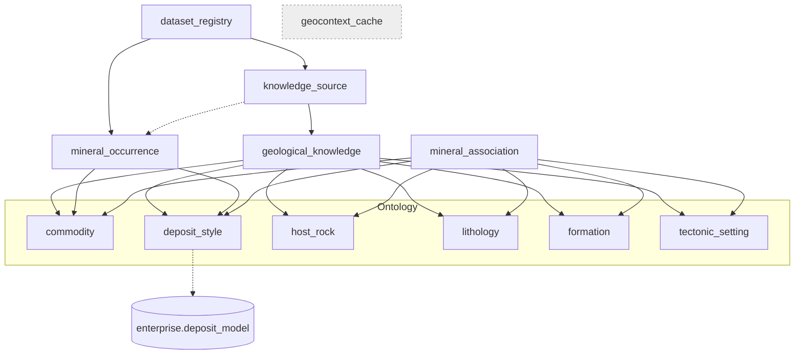

# GeoContext P0 — Completion Report

**Scope:** GeoContext schema foundation (migrations `0044`–`0056`). Additive on the
frozen enterprise core; `public` (22) and mobile app untouched; production not applied.
**Verification:** full-chain `supabase db reset` `0001`→`0056` clean (exit 0). geo
schema now has **15 tables** (3 pre-existing + 12 GeoContext). **Status: P0 COMPLETE.**

---

## 1. Migrations 0044–0056

| # | Migration | Purpose | Key guarantees |
|---|---|---|---|
| 0044 | `geo.dataset_registry` | canonical external-dataset versions | dataset-independent; unique(source_key,version); 1 current/source |
| 0045 | `geo.knowledge_source` | document catalog (reports) | lineage FK→registry (CASCADE); temporal; dedup(checksum) |
| 0046 | `geo.geological_knowledge` | atomic extracted facts | one-row=one-fact; 6 ontology-ready *_key cols; per-fact lineage+temporal |
| 0047 | `geo.commodity` | ontology 1/6 | unique(code); aliases GIN |
| 0048 | `geo.deposit_style` | ontology 2/6 | code aligns w/ enterprise.deposit_model |
| 0049 | `geo.host_rock` | ontology 3/6 | unique(code) |
| 0050 | `geo.lithology` | ontology 4/6 | flat; distinct from taxonomy framework |
| 0051 | `geo.formation` | ontology 5/6 | + geologic age |
| 0052 | `geo.tectonic_setting` | ontology 6/6 | unique(code) |
| 0053 | ontology FK backfill & constraints | wire knowledge→ontology | additive; *_key preserved; 6 FKs ON DELETE SET NULL; deposit_style→deposit_model link; unmapped keys reported |
| 0054 | `geo.mineral_occurrence` | MRDS + extracted occurrences | geom GIST; 4 FKs; dedup(dataset,external_id); ontology-linked |
| 0055 | `geo.mineral_association` | commodity-association graph | 6 FKs; CHECK exactly-one-context; dedup edge |
| 0056 | `geo.geocontext_cache` | runtime cache | service-only; (h3,engine_version) upsert key; TTL |

Every migration: shadow-tested (apply → VERIFY → functional → idempotency → rollback →
re-apply), committed separately (Rule 1).

## 2. Final schema (GeoContext, geo schema)



Runtime state: **all 15 geo tables RLS-enabled**; 11 GeoContext tables are
`authenticated`-readable / writes-service-only; `geocontext_cache` is service-only
(default-deny, 0 policies) by design.

## 3. Table dependency graph (FK edges)

```
dataset_registry
  └─ knowledge_source            (CASCADE)
       └─ geological_knowledge   (CASCADE)  ─┐
       └─ mineral_occurrence     (SET NULL) ─┤
  └─ mineral_occurrence          (CASCADE)   │
ontology: commodity, deposit_style, host_rock, lithology, formation, tectonic_setting
  ├─ geological_knowledge.*_id   (6× SET NULL) ◄┘
  ├─ mineral_occurrence.commodity_id, deposit_style_id (SET NULL)
  └─ mineral_association.* (6×)  (CASCADE)   [CHECK: exactly one context]
deposit_style ─ deposit_model    (SET NULL, cross-schema link)
geocontext_cache                 (standalone, service-only)
```
No cycles; deletes are non-destructive to knowledge (SET NULL on ontology refs),
lineage-consistent (CASCADE down dataset→source→facts).

## 4. Provider readiness (schema support)

| Provider (category) | Backing tables | Schema | Data needed |
|---|---|---|---|
| **GeologyProvider** (A) | `geo.geological_layer` (Sprint 2) | ✅ ready | UNESCO GeoJSON load |
| **OccurrenceProvider** (A) | `geo.mineral_occurrence` | ✅ ready | MRDS load |
| **CommunityProvider** (A) | `enterprise.sample`+verification, `geo.coverage_cell` | ✅ ready | (live app data) |
| **MineralAssociationProvider** (B) | `geo.mineral_association` + ontology | ✅ ready | KB + ontology seed |
| **KnowledgeProvider** (B) | `geo.geological_knowledge` + `knowledge_source` | ✅ ready | extraction pipeline (P2) |
| **Cache / lineage** | `geo.geocontext_cache`, `geo.dataset_registry` | ✅ ready | — |
| Geophysics/Geochem/RemoteSensing/Structural/Hydrology (A, future) | — | ⬜ not in P0 | P3+ |

**Every P0/P1 provider is schema-complete.** What remains is data population, not schema.

## 5. Remaining work before P1
1. **Ontology + KB seed** — populate commodity/deposit_style/host_rock/lithology/
   formation/tectonic_setting and mineral_association (versioned via dataset_registry,
   loaded by the loader script per Decision 2).
2. **Spatial data load** — UNESCO GeoJSON → `geo.geological_layer`; MRDS →
   `geo.mineral_occurrence` (loader script; records `dataset_registry` rows).
3. **deposit_model seed** — so the `deposit_style.deposit_model_id` link backfills.
4. **Engine version constant** — the `engine_version` used for `geocontext_cache` keys.
5. **PostgREST exposure** — `geo` already in `config.toml [api].schemas` locally;
   production "Exposed schemas" is approval-gated.

## 6. Technical debt / assumptions (document before runtime)
1. **Ontology `*_id` on NEW inserts:** 0053's backfill runs once. Facts inserted
   afterward must set `*_id` directly — assumed responsibility of the P2 extraction
   pipeline (or a periodic re-backfill job). No trigger auto-maps `*_key`→`*_id` at
   insert. **Decision needed in P2.**
2. **deposit_style ↔ deposit_model:** link column is nullable and unpopulated until
   `deposit_model` is seeded; alignment currently relies on shared `code` convention.
   Backfill the FK after seeding.
3. **H3:** stored as `text`; no `h3-pg` extension — H3 cell computation happens in the
   Edge Function (app-side), not the DB.
4. **Cache invalidation:** `geocontext_cache` relies on TTL (`expires_at`) +
   `engine_version` bump; there is no automatic invalidation when underlying datasets
   change. A dataset refresh should bump `engine_version` or purge affected cells.
5. **host_rocks / commodities arrays:** `mineral_occurrence.host_rocks[]` and
   `commodities[]` are raw text (multi-valued); only the *primary* commodity/deposit
   dimensions are ontology-FK'd. Multi-valued ontology linkage is deferred.
6. **SRID 4326** assumed for all geo geometries; loaders must reproject.
7. **config.toml** carries the `[api].schemas` (+geo) edit alongside unrelated payment
   edits and is currently uncommitted — to be committed deliberately.

---

**P0 is schema-complete and verified.** On approval, P1 (GeoContext Runtime Engine)
begins: provider interface + engine (parallel/cached) + the schema-ready providers,
emitting the GeoContext JSON.
