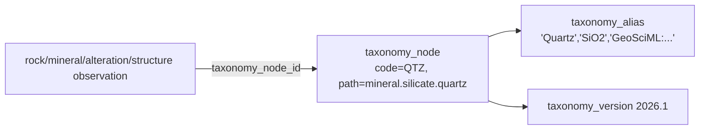

# Luul Scan Enterprise — Architecture Amendment A3
## Advanced Geological, Scientific & Enterprise Extensions

| | |
|---|---|
| **Extends** | Architecture v1.0 · Addendum A1 · Phase 1 Spec · Amendment A2 |
| **Amendment** | A3 |
| **Status** | Design only — **no code, SQL, or migrations**. |
| **Purpose** | Triage 15 advanced proposals: fold the foundational ones into Phase 1, install cheap **hooks** for the heavy ones, and **schedule** the rest to their proper phases — without breaking Phase-1 discipline. |

> These 15 proposals are excellent and push the design from "very good" to "exploration-industry-grade." But not all belong in Phase 1 — the discipline that has protected this project is *foundation now, machinery later*. A3 keeps that discipline: **add what is cheap and structurally load-bearing now; sketch + hook what is heavy so it slots in later with zero redesign.**

**Target of A3 (per your scoring):** raise **Geological modelling 8.5 → ~10** and **Scientific reproducibility 8 → ~10**, while keeping Scalability/Security/Offline at 10.

---

## A3.0 — Triage of the 15 proposals

| # | Proposal | Disposition | Why |
|---|---|---|---|
| 1 | **Geological Taxonomy** | 🟢 **P1-Core** | Load-bearing: replaces free text everywhere; enables clean AI + standards mapping |
| 2 | **Lab Chain of Custody** | 🟢 **P1-Core** | Industry standard; sample integrity; cheap schema now |
| 3 | **Geologic Time Scale** | 🟢 **P1-Core** | Small seed lookups; needed for rock age |
| 4 | **Deposit Model Library** | 🟢 **P1-Core** | Small lookup; AI target vocabulary later |
| 11 | **Audit Ledger (immutable)** | 🟢 **P1-Core** | Upgrades A2 `audit_log` → tamper-evident; enterprise requirement |
| 12 | **Configuration Tables** | 🟢 **P1-Core** | Generalizes A2 `score_config`; no formulas in code |
| 13 | **Notification / Event System** | 🟢 **P1-Core** | The missing event bus; drives verify→recompute→coverage→AI-queue |
| 14 | **Feature Flags** | 🟢 **P1-Core** | Enterprise standard; per-tenant rollout |
| 5 | **Geological Knowledge Graph** | 🟡 **P1-Hook** | Add a typed-edge table now; full graph analytics = Phase 5 |
| 8 | **Spatial Raster Registry** | 🟡 **P1-Hook** | Registry metadata now (cheap); raster ingestion = Phase 4 |
| 9 | **Sensor Abstraction Layer** | 🟡 **P1-Hook** | Thin abstraction now; drone/XRF/LiDAR pipelines = Phase 4 |
| 10 | **Offline Conflict Engine** | 🟡 **P1-Hook** | `conflict_log` schema now; merge engine = Sprint 6 |
| 6 | **AI Dataset Versioning** | 🔵 **Later (P6)** | Belongs to the AI phase; hooked via `ml_feature`/`feature_snapshot` |
| 7 | **Explainable AI DB** | 🔵 **Later (P6)** | `ml_score.explanation` already hooks it; normalize in P6 |
| 15 | **International Standards** | 🔵 **Later (P7)** | Export/mapping concern; hooked via `taxonomy_alias` external codes |

**Rule of thumb:** 🟢 = build the tables in Phase 1 (mostly lookups/registries, low cost, high structural value). 🟡 = build a **thin enabling table/hook** now so the heavy feature adds later without a migration to existing tables. 🔵 = design sketch + a pre-existing hook; **do not build in Phase 1**.

---

## A3.1 — P1-Core additions

### A3.1.1 Geological taxonomy system  (#1, Very High)
Replaces free-text `rock_class`/`mineral`/`alteration_type`/`structure_type` with **controlled, versioned, hierarchical vocabularies**, so "Quartz" is one ID everywhere and maps to external standards.

```text
enterprise.taxonomy
  id uuid pk
  domain text not null              -- rock | lithology | mineral | alteration | structure | deposit_model
  name text not null
  current_version_id uuid           -- -> taxonomy_version
  created_at timestamptz

enterprise.taxonomy_version
  id uuid pk
  taxonomy_id uuid -> taxonomy(id)
  version text not null             -- e.g. "2026.1"
  source text                       -- e.g. "IUGS", "GeoSciML", "internal"
  published_at timestamptz
  Unique (taxonomy_id, version)

enterprise.taxonomy_node
  id uuid pk
  taxonomy_id uuid -> taxonomy(id)
  parent_id uuid -> taxonomy_node(id)   -- hierarchy (Igneous → Volcanic → Basalt)
  code text not null                    -- stable machine code
  label text not null                   -- human label
  level smallint                        -- depth
  path text                             -- materialized "igneous.volcanic.basalt" (fast subtree)
  attributes jsonb
  Unique (taxonomy_id, code)
  Index: btree(taxonomy_id, parent_id), btree(code), btree(path)

enterprise.taxonomy_alias
  id uuid pk
  node_id uuid -> taxonomy_node(id)
  alias text not null                   -- synonym OR external standard code
  source text                           -- "common", "GeoSciML:...", "USGS:...", "JORC:..."
  Unique (node_id, alias, source)
```

**Integration:** `rock_observation`, `mineral_observation`, `alteration_observation`, `structural_measurement`, and `sample.formation_id` gain a **nullable `taxonomy_node_id` FK** (kept alongside the free-text field during a transition window; free text is deprecated once the taxonomy is seeded). Taxonomy domains seeded: **rock (Igneous/Sedimentary/Metamorphic → lithology hierarchy), mineral, alteration, structure, deposit_model.** `taxonomy_alias.source` carrying `GeoSciML:`/`USGS:` codes is the **hook for #15**.

### A3.1.2 Geologic time scale  (#3)
```text
enterprise.geologic_time             -- single self-referencing table (ICS chart)
  id uuid pk
  rank text not null                 -- eon | era | period | epoch | age
  name text not null                 -- "Archean", "Neoproterozoic", "Holocene"
  parent_id uuid -> geologic_time(id)
  start_ma numeric(8,3)              -- millions of years ago
  end_ma numeric(8,3)
  Unique (rank, name)
  Index: btree(parent_id), btree(rank)
```
`sample`/`rock_observation` gain nullable `age_time_id` (→ geologic_time). Seeded from the ICS chart. (One self-referencing table is cleaner than separate era/period/epoch tables and yields the same hierarchy.)

### A3.1.3 Deposit model library  (#4)
```text
enterprise.deposit_model             -- lookup (seed)
  id uuid pk
  code text unique not null          -- orogenic_gold | epithermal | iocg | vms | porphyry | pegmatite | laterite | ree | ...
  name text not null
  commodity text                     -- primary commodity family
  description text
  typical_hosts uuid[]               -- taxonomy_node ids (host rocks)
  attributes jsonb
```
`exploration_area` / `occurrence_evidence` gain nullable `candidate_deposit_model_id`. In Phase 6, AI outputs "most similar deposit model + probability" into `ml_score` referencing this library — **no schema change needed then.**

### A3.1.4 Laboratory chain of custody  (#2)
```text
enterprise.sample_container
  id uuid pk, sample_id uuid -> sample(id)
  container_code text unique         -- bag/label barcode
  sealed_by uuid, sealed_at timestamptz, notes text

enterprise.shipment
  id uuid pk, organization_id uuid -> organization(id)
  carrier text, tracking_ref text
  origin text, destination_lab text
  shipped_at / received_at timestamptz
  status text                        -- created | in_transit | received | prepared | assayed

enterprise.sample_chain_event        -- Field→Bagged→Transported→Received→Prepared→Assayed→Verified
  id uuid pk
  sample_id uuid -> sample(id)
  container_id uuid -> sample_container(id)
  shipment_id uuid -> shipment(id)   -- nullable
  event_type text not null           -- collected|bagged|transported|received|prepared|assayed|verified
  actor_id uuid, occurred_at timestamptz
  location geography(Point,4326)      -- optional
  notes text
  Index: btree(sample_id), btree(event_type), btree(shipment_id)

enterprise.custody_signature
  id uuid pk
  chain_event_id uuid -> sample_chain_event(id)
  signer_id uuid, signed_at timestamptz
  signature_hash text                -- signed payload hash (tamper-evident)
```
Gives sample provenance an auditable custody trail — the standard exploration companies require.

### A3.1.5 Immutable audit ledger  (#11 — upgrades A2 `audit_log`)
Extend A2's `audit_log` into a **tamper-evident hash-chained ledger**:
```text
enterprise.audit_log  (+ additions)
  + prev_hash text                   -- previous row's row_hash (per entity or global chain)
  + row_hash text                    -- hash(actor, action, entity, before, after, prev_hash, ts)
  + device_id text
  + ip_hash text                     -- hashed IP (privacy)
  + signature text                   -- optional service signature
```
Append-only; any tampering breaks the hash chain (detectable). Write path unchanged (service role only).

### A3.1.6 Configuration table family  (#12 — generalizes A2 `score_config`)
Keep **one namespaced config table** (simpler than many):
```text
enterprise.config_entry
  namespace text not null            -- score_weights | verification_rules | trust_rules | thresholds | ai_parameters | mission_parameters
  key text not null
  value jsonb not null
  description text
  organization_id uuid               -- nullable = global default; set = per-tenant override
  updated_by uuid, updated_at timestamptz
  PK (namespace, key, coalesce(organization_id, '00000000-...'))
```
Edge Functions read config (tenant override → global default → safe in-code default). Admin-writable. **No formula ever hard-coded in a function.**

### A3.1.7 Notification / event system  (#13 — the event bus)
```text
enterprise.event                     -- append-only domain event bus
  id uuid pk
  type text not null                 -- sample.verified | area.confidence_changed | mission.completed | ...
  organization_id uuid
  actor_id uuid
  subject_type text, subject_id uuid
  payload jsonb
  created_at timestamptz
  Index: btree(type), btree(subject_type, subject_id), brin(created_at)

enterprise.notification
  id uuid pk, user_id uuid -> auth.users(id)
  event_id uuid -> event(id)
  channel text                       -- in_app | email | push
  read_at timestamptz, created_at timestamptz
  Index: btree(user_id, read_at)

enterprise.notification_subscription (user_id, event_type, channel, enabled)   -- prefs
enterprise.webhook_endpoint          -- outbound (enterprise integrations)
  id uuid pk, organization_id uuid, url text, secret_hash text, event_types text[], active bool
```
**Flow:** `sample.verified` event → workers fan out: notify collector · recompute confidence · refresh coverage cell · enqueue AI (later). Decouples side-effects from the write path.

### A3.1.8 Feature flags  (#14)
```text
enterprise.feature_flag
  key text pk, description text, default_enabled bool, is_beta bool

enterprise.tenant_feature            -- per-org override
  organization_id uuid -> organization(id)
  feature_key text -> feature_flag(key)
  enabled bool
  PK (organization_id, feature_key)
```
Per-tenant / beta rollout without redeploys.

---

## A3.2 — P1-Hook additions (thin enablers; heavy feature lands later)

### A3.2.1 Knowledge-graph edge table  (#5 → full analytics Phase 5)
```text
enterprise.geo_relationship          -- typed edges: (subject) -[predicate]-> (object)
  id uuid pk
  subject_type text, subject_id uuid   -- e.g. mineral node / sample / vein
  predicate text not null              -- occurs_in | hosted_by | inside | near | altered_to
  object_type text, object_id uuid     -- e.g. structure / area / formation
  weight numeric, source text, created_at timestamptz
  Index: btree(subject_type, subject_id), btree(object_type, object_id), btree(predicate)
```
Records the Quartz→occurs_in→Vein→inside→Greenstone Belt→inside→Area graph **now**; graph traversal/analytics (and any graph DB) come in Phase 5. No redesign needed.

### A3.2.2 Spatial raster layer registry  (#8 → ingestion Phase 4)
```text
geo.raster_layer_registry            -- METADATA only (no raster bytes in Phase 1)
  id uuid pk
  kind text                          -- terrain | magnetic | gravity | satellite
  source text                        -- SRTM | Sentinel | Landsat | ASTER | DEM | ...
  name text, extent geography(Polygon,4326)
  resolution_m numeric, crs text
  storage_ref text                   -- where the tiles will live (later)
  status text                        -- registered | ingesting | available
  attributes jsonb, created_at timestamptz
```
Layers can be **catalogued now**; actual raster import + terrain analysis is Phase 4 (`postgis_raster` enabled then).

### A3.2.3 Sensor abstraction  (#9 → pipelines Phase 4)
```text
enterprise.sensor_type (id, code, name, modality)    -- drone|thermal|spectrometer|xrf|lidar
enterprise.sensor (id, organization_id, sensor_type_id, model, serial, calibration jsonb)
enterprise.sensor_capture (id, sensor_id, sample_id?, area_id?, captured_at, location geography, metadata jsonb)
enterprise.sensor_file (id, capture_id, storage_path, format, size_bytes)
```
Thin abstraction so drone/thermal/XRF/LiDAR attach later **without touching `sample`**. Ingestion/processing pipelines are Phase 4.

### A3.2.4 Offline conflict log  (#10 → merge engine Sprint 6)
```text
enterprise.conflict_log
  id uuid pk
  entity_type text, entity_id uuid
  device_a text, device_b text
  base_version jsonb, version_a jsonb, version_b jsonb
  strategy text                      -- last_write_wins | field_merge | manual
  resolution jsonb, resolved_by uuid, resolved_at timestamptz
  status text                        -- open | resolved
  created_at timestamptz
```
Schema now; the **merge strategy engine + audit replay** (using the A3.1.5 ledger) are built in Sprint 6. Because field observations are append-only, true conflicts are rare — this captures the edge cases so **no data is lost when two people edit the same sample.**

---

## A3.3 — Deferred (design sketch + existing hook; NOT built in Phase 1)

| # | Feature | Phase | Pre-existing hook | Sketch |
|---|---|---|---|---|
| 6 | **AI dataset versioning** | P6 | `ml.ml_feature`, `ml.ml_model` | `dataset`, `dataset_version`, `training_run`, `validation_run`, `model_version`, `feature_snapshot` — reproducibility of every model↔dataset. Built when AI training starts. |
| 7 | **Explainable AI DB** | P6 | `ml.ml_score.explanation jsonb` | Normalize into `prediction → prediction_evidence → feature → weight` so the app can say "Quartz vein + Fe-staining + shear zone ⇒ high score." Built with the first model. |
| 15 | **International standards** | P7 | `taxonomy_alias.source` (external codes) | Export mappers to CRIRSCO/JORC/NI 43-101/CIM/USGS/OneGeology/GeoSciML. Because taxonomy already carries external codes, export is a mapping layer, not a re-model. |

**Why deferred:** these are **machinery of the AI/commercial phases**. Building them in Phase 1 would add cost and risk with no Phase-1 payoff, and the hooks above guarantee they slot in **without altering any Phase-1 table.**

---

## A3.4 — How free text is eliminated (AI-cleanliness)

Before A3, observations stored free text (`rock_class = "quartz vein"`). After A3:



Every "Quartz" is **one node ID**, versioned, alias-resolved, and standards-mapped — exactly what reliable AI training and industry export require. Free-text fields remain temporarily for migration, then are retired.

---

## A3.5 — Updated frozen table list (A2 + A3)

**enterprise (P1-Core adds):** taxonomy · taxonomy_version · taxonomy_node · taxonomy_alias · geologic_time · deposit_model · sample_container · shipment · sample_chain_event · custody_signature · config_entry · event · notification · notification_subscription · webhook_endpoint · feature_flag · tenant_feature *(+ audit_log gains ledger columns)*
**enterprise (P1-Hook adds):** geo_relationship · sensor_type · sensor · sensor_capture · sensor_file · conflict_log
**geo (P1-Hook adds):** raster_layer_registry
**Deferred (NOT built):** dataset/dataset_version/training_run/validation_run/model_version/feature_snapshot (P6) · prediction/prediction_evidence (P6) · standards export mappers (P7)

Plus all A2 tables. Common conventions (UUID PK, timestamps, `created_by`, `deleted_at`, RLS, CHECKs, indexed FKs, GIST on geo) apply.

**Scope note (honest):** A3 grows the Phase-1 surface meaningfully. The 🟢 P1-Core set is high-value and low-risk (mostly lookups/registries) and is **recommended**. The 🟡 P1-Hook set is cheap but optional — if you prefer a leaner first migration, the hooks (KG, sensor, raster registry, conflict_log) can move to **Phase 2** without any redesign, since nothing else depends on them yet.

---

## A3.6 — Effect on your scorecard

| Dimension | Before | After A2+A3 | Driver |
|---|---|---|---|
| Database architecture | 10 | 10 | maintained |
| Offline architecture | 10 | 10 | + conflict_log/replay hook |
| Enterprise readiness | 9.5 | **10** | audit ledger, events, feature flags, org model (A2), config |
| AI readiness | 9.5 | **10** | taxonomy, deposit models, absence data (A2), explainable/dataset hooks |
| Scalability | 10 | 10 | maintained (partitioning, incremental coverage) |
| Security / RLS | 10 | 10 | maintained (A2 authZ + column protection) |
| **Geological modelling** | 8.5 | **~10** | taxonomy, time scale, deposit models, alteration/structure (A2), chain of custody, KG hook |
| **Scientific reproducibility** | 8 | **~10** | immutable audit ledger, config tables, dataset/versioning hooks, taxonomy versioning |

---

## A3.7 — Freeze confirmation

With **A2 + A3**, the design is **complete and internally consistent**:
- All Critical items resolved (A2); all high-value geological/enterprise/reproducibility gaps addressed or hooked (A3).
- Consumer app untouched; enterprise additive & isolated.
- Heavy later-phase machinery is **hooked, not built** — zero redesign risk.

**The Phase-1 schema is FROZEN-READY.**

**P1-Hook scope — DECIDED:** include **ALL** hooks now as **interfaces/config only** — sensor, raster/DEM registry, ML, future-AI-pipeline, and analytics hooks are all created as **empty placeholder tables** in the first migration. Constraints on the decision: **no processing logic, no new dependencies, no heavy queries, no consumer-app behavior change.** Rationale: the schema and architecture then never need to change when Phase 2+ arrives — later features only *fill* these interfaces, never *reshape* them.

**Next (on approval):** Sprint 1 Implementation Plan → migrations (`0018_`…) → RLS → Edge Functions → offline sync → RN integration — built to v1.0 + A1 + Phase-1 Spec + **A2 + A3**.

---

*End of Amendment A3. Design only — no code, SQL, or migrations produced.*
