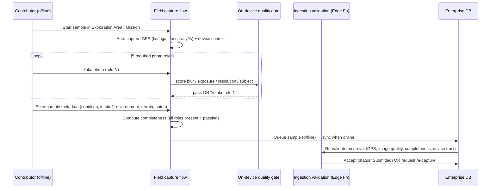
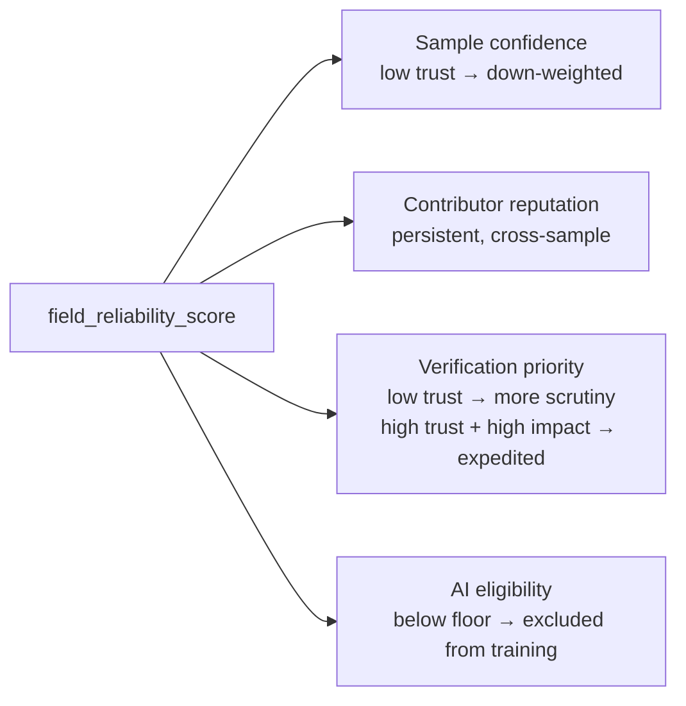
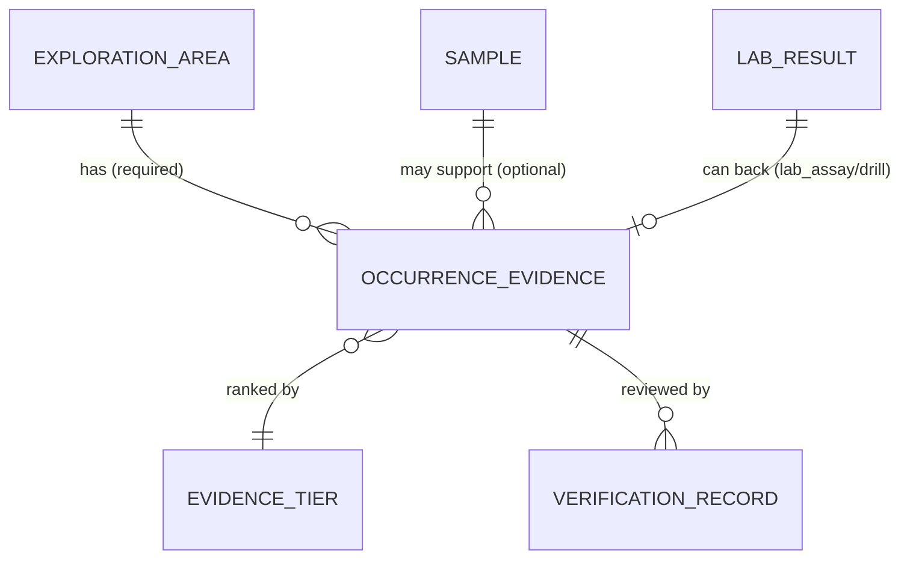
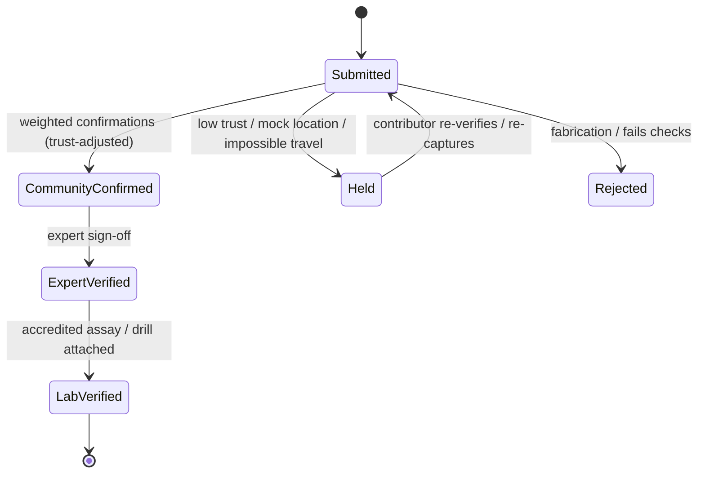

# Luul Scan Enterprise Architecture — Addendum A1
## Pre-Phase-1 Review: Field Data Quality, Device Trust & Occurrence Evidence

| | |
|---|---|
| **Extends** | [Luul Scan Enterprise Architecture v1.0](./LuulScan-Enterprise-Architecture-v1.md) |
| **Addendum** | A1 |
| **Status** | Draft for engineering review — pre-Phase-1 |
| **Scope** | Adds three missing components. Does **not** rewrite the architecture, write code, or create migrations. Updates only the affected sections. |

> This is a **review addendum**. It layers three components onto v1.0 to raise **data quality, field reliability, and AI readiness** before Phase 1. All original principles hold: **no certainty claims · no replacement of geologists · probabilistic intelligence only · strict consumer/enterprise separation.** Every schema is an illustrative **design proposal**, not a migration.

---

## Contents
- **A1.1** Field Sample Collection Protocol
- **A1.2** Field Device Trust System
- **A1.3** Mineral Occurrence Evidence System
- **A1.4** Updated affected sections (deltas only)
- **A1.5** Consolidated new entities & relationships
- **A1.6** Why these additions improve Luul Scan Enterprise
- **A1.7** Phase 1 readiness confirmation

---

## A1.1 — Field Sample Collection Protocol

### A1.1.1 Objective
Standardize how contributors capture geological observations in remote areas so that **every enterprise sample carries consistent, complete, AI-ready data**. A sample is only accepted when it meets the protocol.

### A1.1.2 Required capture workflow



The workflow **reuses the existing Smart Capture** multi-shot flow from the consumer app; the enterprise layer adds **semantic roles** to each shot and a **completeness gate**.

### A1.1.3 Required capture data

**Location data (auto-captured, all required):**
`latitude · longitude · altitude · gps_accuracy_m · timestamp · device information` (see A1.2).

**Photography protocol — 5 required roles (minimum):**

| # | Role | Captures | Purpose |
|---|------|----------|---------|
| 1 | **Environmental context** | Rock in its natural location | Setting, in-situ vs float, surroundings |
| 2 | **Close-up surface detail** | Surface texture at short range | Grain, luster, mineral surface |
| 3 | **Texture & structure** | Structure/fabric of the rock | Foliation, bedding, crystallinity |
| 4 | **Key features** | Mineral veins, alteration, staining | Gold-pathfinder features, veining |
| 5 | **Scale reference** | Object of known size beside sample | Absolute size for measurement & AI |

**Sample metadata:**
`rock_condition · in_situ_or_transported · geological_environment · terrain_type · collector_notes · weather_conditions (optional) · field_observations`.

### A1.1.4 Why multiple angles are required
- A single photo **cannot disambiguate** context (where it was), surface (what it is), structure (how it formed), and scale (how big).
- Different roles feed **different model inputs** — context for setting classification, close-up/texture for mineral/rock classification, features for pathfinder detection, scale for size normalization.
- Redundancy makes classification **robust** to a bad frame and enables **cross-checks** (e.g., claimed size vs scale reference).

### A1.1.5 How image quality affects AI reliability
- AI is **garbage-in, garbage-out**: blur, poor exposure, and low resolution degrade feature extraction and inflate misclassification.
- Enterprise training data must be **quality-gated** so models learn from clean, representative images.
- Each media row stores an **`image_quality_score`**; a sample's usability for AI depends on **all required roles passing** a minimum threshold.

### A1.1.6 How poor images are rejected / re-requested
- **At capture (on-device):** the existing quality gate scores each shot and prompts *"retake role N"* before the sample can be completed.
- **At ingestion (server):** Edge Function re-validates; if a role is missing or below threshold, the sample is held as **`Incomplete`** and the contributor is asked to re-capture the **specific** failing role (not the whole sample).
- Samples that never reach completeness never enter AI training and do not raise area confidence.

### A1.1.7 Proposed schema deltas (design only)

```text
-- extend sample_media with a semantic role + quality
sample_media
  + role enum(context, surface_closeup, texture_structure, key_feature, scale_reference, extra)
  + is_required boolean
  + image_quality_score numeric
  + retake_requested boolean

-- extend sample with completeness + richer field metadata
sample
  + rock_condition text
  + in_situ boolean                 -- in-situ vs transported (float)
  + geological_environment text
  + weather_conditions text          -- optional
  + field_observations text
  + completeness_status enum(incomplete, complete)   -- all required roles present + passing
```

---

## A1.2 — Field Device Trust System

### A1.2.1 Objective
Protect the geological database from **inaccurate or fabricated submissions**. Because contributors work in **remote areas where location accuracy is critical**, we add a **device-provenance + trust-scoring** layer.

### A1.2.2 Device provenance (design)

```text
sample_device_context               -- 1:1 with sample (or embedded on sample)
  sample_id fk pk
  device_id            text          -- stable, app-scoped device identifier
  app_version          text
  os                   text          -- e.g. "Android 16"
  gps_source           enum(gps, fused, network, manual)
  capture_timestamp    timestamptz   -- device clock at capture
  mock_location        boolean       -- OS mock-location flag detected
  offline_capture      boolean       -- captured with no connectivity
  sync_timestamp       timestamptz   -- when it reached the server
```

### A1.2.3 Field reliability (trust) score

A per-sample **`field_reliability_score`** (0–100) computed at ingestion from:

| Signal | Raises trust | Lowers trust |
|---|---|---|
| **GPS accuracy** | ≤ ~5–10 m | > ~50 m |
| **Device consistency** | Same device/OS/app as contributor's history | New/rooted device, mock-location flag |
| **Historical contributor behavior** | Good verification track record (reputation) | Past rejections / disputes |
| **Duplicate submissions** | Unique location/time | Near-identical repeats |
| **Suspicious movement** | Physically plausible travel between samples | **Impossible travel** (haversine ÷ Δtime > human/vehicle speed) |

Mock-location = strong negative (often an automatic hold). Offline capture is **normal** (expected in the field) and is *not* penalized on its own; it just defers final validation to sync time.

### A1.2.4 Effects of the trust score



- **Sample confidence:** a low-trust sample is down-weighted even if its images are good.
- **Contributor reputation:** repeated low-trust/mock submissions erode reputation (§11.3); consistent good submissions build it.
- **Verification priority:** the queue prioritizes (a) high-impact evidence and (b) items whose trust is borderline; obvious fabrications are auto-held/rejected.

---

## A1.3 — Mineral Occurrence Evidence System

### A1.3.1 Objective
Record **evidence that indicates a *possible* mineral occurrence** — explicitly separate from a single sample observation. **A sample alone is never a confirmed deposit.** Occurrence evidence links geological observations to **stronger, external evidence sources** and ranks them by reliability.

> Terminology (enforced in UI + reports): **observation → occurrence evidence → (never) deposit.** "Occurrence" means *something was reported/observed here*; it is **not** a confirmed, economic deposit.

### A1.3.2 Proposed entity (as specified)

```text
occurrence_evidence
  id                  uuid pk
  exploration_area_id fk  -> exploration_area.id   (required)
  sample_id           fk  -> sample.id             (optional)
  evidence_type       enum(visible_gold, historical_mining, previous_exploration,
                           lab_assay, drill_result, gov_academic_reference,
                           community_report)
  description         text
  source              text                          -- citation / lab / agency / person
  confidence_score    numeric(5,2)                   -- derived from tier + verification
  verification_status enum(unverified, community_confirmed, expert_verified, lab_verified)
  verified_by         uuid  -> app_user.id           (nullable)
  created_at          timestamptz
```

### A1.3.3 Evidence hierarchy (reliability ranking)

| Tier | Evidence types | Weight (design) |
|---|---|---|
| **Highest** | Accredited **laboratory assay**, verified **drill results** | Ground truth |
| **Medium** | **Expert geological observation**, **historical mining records** | Strong prior |
| **Lower** | **Visual observation**, **community report** | Weak signal only |

A small `evidence_tier` lookup maps each `evidence_type` → tier → weight, so ranking is data-driven and tunable.

### A1.3.4 How the hierarchy influences AI training data

- **Only Highest-tier evidence** (accredited assay / verified drill) may serve as **positive ground-truth labels** for prospectivity targets.
- **Medium-tier** evidence acts as a **prior / feature**, never a hard label.
- **Lower-tier** evidence is **exploratory signal only** — it can guide *where to look*, but is **excluded from training labels** to avoid manufacturing false positives.
- This mirrors the honesty rule: models predict **similarity/probability**, calibrated against **verifiable** ground truth, not anecdotes.

### A1.3.5 Relationships



Area confidence (§11.4) is now influenced by the **best-tier verified occurrence evidence** present, not just sample counts.

---

## A1.4 — Updated affected sections (deltas only)

### Δ §8 Field Contributor system
- Contributors must follow the **Field Sample Collection Protocol** (A1.1); samples that fail completeness are not credited.
- A contributor's **device context** (A1.2) is recorded per sample; mock-location/impossible-travel patterns affect **reputation**.

### Δ §10 Database architecture
- `sample_media` gains **`role` / `is_required` / `image_quality_score` / `retake_requested`** (A1.1.7).
- `sample` gains **completeness + richer field metadata** (A1.1.7) and a **`field_reliability_score`** (A1.2.3).
- New **`sample_device_context`** (A1.2.2), **`occurrence_evidence`** (A1.3.2), and **`evidence_tier`** lookup.

### Δ §11 Data quality system
- New per-sample **`field_reliability_score`** joins the existing GPS/image/reputation scores.
- **Completeness gate:** a sample is AI-eligible only when all required photo roles pass.
- **Area confidence** now blends: verified samples + coverage **+ best-tier verified occurrence evidence**.

### Δ §11.2 Verification workflow
- **Verification priority** is driven by trust score + evidence impact (A1.2.4).
- **`occurrence_evidence`** has its **own verification ladder**; **lab_assay / drill_result** fast-track to `lab_verified` and can elevate area status.



### Δ §13 AI roadmap
- **Training-label eligibility** is now governed by the **evidence hierarchy** (A1.3.4): only Highest-tier verified evidence labels positives.
- **Multi-role imagery** (A1.1) improves classifier reliability; **device trust** (A1.2) filters poisoned inputs before training.
- Output contract unchanged: **probabilistic, explained, uncertainty-banded — never certainty.**

---

## A1.5 — Consolidated new entities & relationships

| Entity | Type | Key links |
|---|---|---|
| `sample_device_context` | New (1:1 sample) | → `sample` |
| `occurrence_evidence` | New | → `exploration_area` (req), → `sample` (opt), → `evidence_tier`, → `verification_record` |
| `evidence_tier` | New lookup | referenced by `occurrence_evidence.evidence_type` |
| `sample_media` (roles) | Extended | + `role`, `is_required`, `image_quality_score`, `retake_requested` |
| `sample` (protocol + trust) | Extended | + completeness, field metadata, `field_reliability_score` |

All additions are **enterprise-schema only** — the consumer/enterprise separation (§5) is preserved.

---

## A1.6 — Why these additions improve Luul Scan Enterprise

1. **AI-ready by construction.** Standardized 5-role imagery + completeness gating means the training set is consistent and clean from day one, rather than a cleanup project later.
2. **Fabrication-resistant.** Device provenance + trust scoring (mock-location, impossible-travel, duplicates) protects the database's core asset — its credibility.
3. **Evidence, not anecdote.** The occurrence-evidence hierarchy ensures only verifiable ground truth trains predictive models, keeping outputs honest and calibrated.
4. **Better verification economics.** Trust-and-impact prioritization focuses scarce expert time where it matters, unblocking the verification ladder.
5. **Principle-preserving.** Every addition reinforces (not weakens) the four core principles: no certainty, no replacing geologists, probabilistic-only, consumer/enterprise separation.

---

## A1.7 — Phase 1 readiness confirmation

With this addendum, the enterprise data foundation is **design-complete for Phase 1**. The Phase 1 schema set now includes:

- Core geography & people: `exploration_area`, `app_user`, `field_contributor`, `area_membership`.
- Field evidence: `sample`, `sample_location`, `sample_media` (with roles), `sample_device_context`, `rock_observation`, `mineral_observation`.
- Trust & quality: per-sample scores, completeness gate, `field_reliability_score`.
- Evidence & verification: `occurrence_evidence`, `evidence_tier`, `verification_record`, `lab_result`.

**Confirmation:** the architecture (v1.0 + Addendum A1) is **consistent, principle-compliant, and ready for Phase 1 database implementation.** Phase 1 remains a **design-to-implementation** step — actual tables, migrations, RLS policies, and Edge Functions are produced during Phase 1 execution, not in this document.

---

*End of Addendum A1. Design blueprint only — no code, migrations, or application changes are included or implied.*
