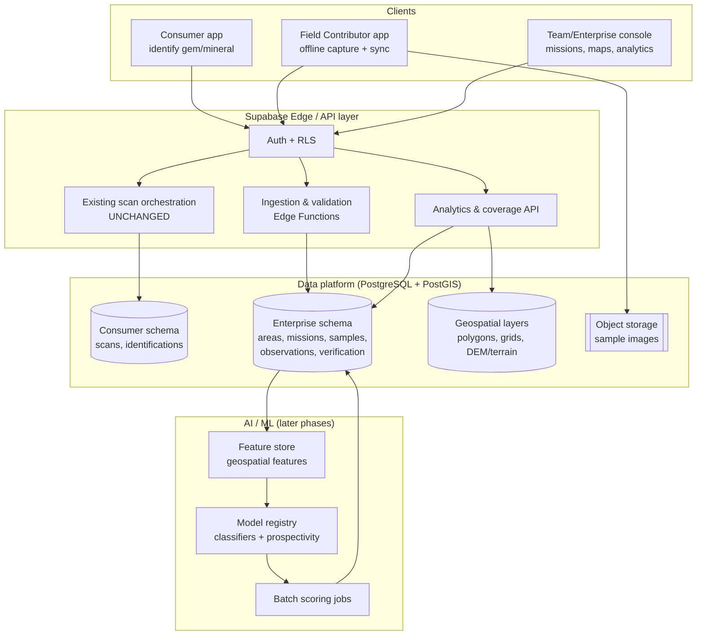
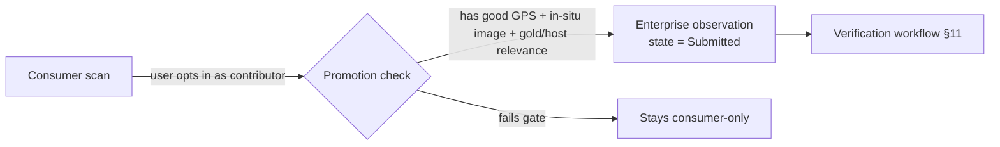
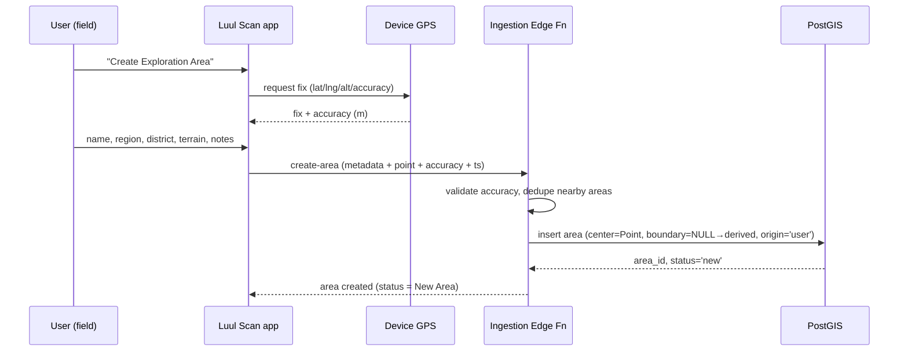
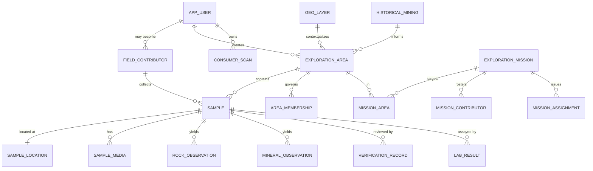
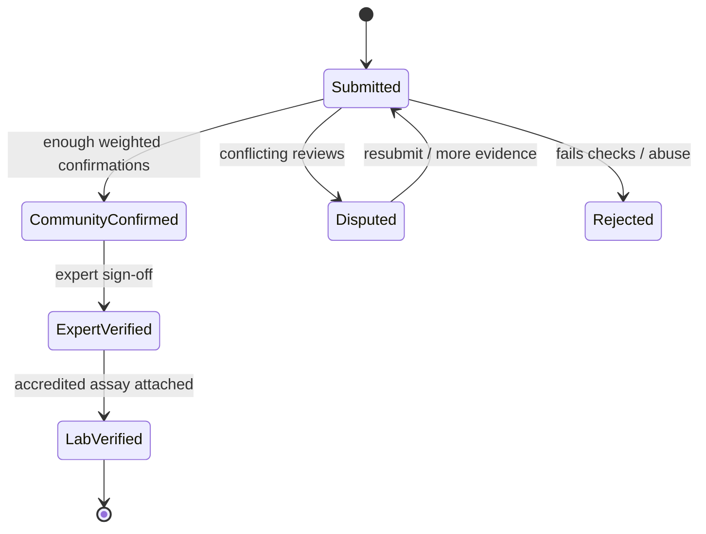
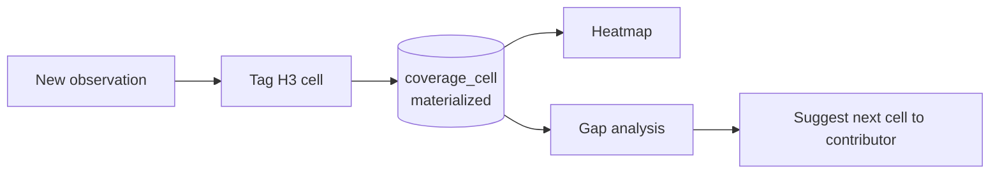

# Luul Scan Enterprise Exploration Intelligence Platform
## Technical Architecture — v1.0 (Master Blueprint)

| | |
|---|---|
| **Document** | Luul Scan Enterprise Architecture |
| **Version** | 1.0 (blueprint — pre-implementation) |
| **Status** | Draft for engineering review |
| **Author role** | Software architect · GIS systems designer · AI data-platform architect |
| **Audience** | Engineering, product, and data-science teams |
| **Scope** | Design only. No production code, no migrations, no changes to the existing Luul Scan app. |

> This document is the blueprint that must be approved **before** implementation begins. It describes *what to build and why*, not *the code*. Every schema shown is a **design proposal** written in illustrative pseudo-DDL — it is not a migration and must not be run as-is.

---

## 0. Reading guide

- **Sections 1–3** — vision, principles, constraints.
- **Sections 4–9** — the system design (domains, geography, geospatial, roles, missions).
- **Section 10** — proposed database architecture (entities + relationships).
- **Sections 11–13** — data quality, coverage intelligence, AI roadmap.
- **Sections 14–15** — Supabase platform + security/ownership.
- **Section 16** — phased implementation roadmap.
- **Section 17** — technical risks and mitigations.
- **Section 18** — appendices (glossary, lifecycle states, grid math).

---

## 1. Executive summary

Luul Scan today is a **consumer identification app**: a user photographs a gem, mineral, coin, or gold-host rock and receives an AI identification, a valuation, and (for gold-host rocks) a rule-based Gold Prospect Evaluation.

The **Enterprise Exploration Intelligence Platform** extends this foundation into a **geological data-collection, GIS-mapping, and AI-assisted exploration platform**. It lets individual users, field contributors, exploration teams, and mining organizations collect **structured, GPS-tagged geological observations** and progressively build a **proprietary exploration database**.

The platform is explicitly **not** a replacement for professional geologists and **never** claims certainty about buried mineralization. Its value is the **structured dataset** and the **probabilistic intelligence** derived from it: *"this area is geologically similar to known gold-bearing districts,"* never *"gold is here."*

Two design decisions dominate everything that follows:

1. **Consumer and Enterprise data are separated by design.** Casual consumer scans never silently pollute the enterprise geological dataset; they can only *enter* it through an explicit promotion + verification path.
2. **Areas are user-extensible.** The system ships with known districts (Cal Miskaad, Cal Madow, Karkaar, Milxa, …) but any user can create a brand-new Exploration Area anywhere, and many users can contribute to the same area.

---

## 2. Product vision & objectives

**Vision.** Turn every field observation into a durable, verifiable, geospatially-indexed data point, and turn the accumulated dataset into exploration intelligence.

**Primary objectives**

| # | Objective | Success signal |
|---|-----------|----------------|
| O1 | Structured field data capture (GPS + media + geology notes) | Observations per week; % with high GPS + image quality |
| O2 | User-extensible geography (known + new areas) | New areas created; multi-contributor areas |
| O3 | Data quality you can trust | % observations reaching *Verified*; contributor reputation distribution |
| O4 | Coverage intelligence (where to explore next) | % of target grid cells with ≥N samples; duplicate-scan rate ↓ |
| O5 | Probabilistic exploration AI (later phases) | Backtested prospectivity AUC; expert agreement rate |
| O6 | Enterprise offering (teams, missions, private projects) | Paying orgs; missions completed; data licensed |

**Non-objectives (explicit)**

- Not a mineral-claim registry or a legal land-rights system.
- Not an assurance of economic mineralization.
- Not a replacement for drilling, assaying, or a licensed geologist's sign-off.

---

## 3. Guiding principles & core constraints

**Principles**

1. **Honesty by construction.** All exploration outputs are probabilistic and carry provenance + confidence. UI and reports never imply certainty of gold.
2. **Separation of concerns.** Consumer identification ≠ enterprise geological evidence. Different tables, different quality gates, different access rules.
3. **Extensible geography.** No hard-coded finite list of places. Known districts are *seed data*, not a boundary.
4. **Offline-first field capture.** Contributors work where there is no network; the app queues and syncs.
5. **Provenance everywhere.** Every enterprise record knows who captured it, when, where, with what accuracy, and how it was verified.
6. **Additive evolution.** The enterprise platform is layered *alongside* the current app; existing consumer features keep working unchanged.

**Hard constraints for the current phase (this document)**

- Do **not** write production code.
- Do **not** modify the existing Luul Scan application.
- Do **not** create database migrations.
- Do **not** change existing features or build UI.
- Deliver the **architecture document only**.

---

## 4. System context & high-level architecture



**Key point:** the existing **scan orchestration path (E3 → D1) is untouched.** Enterprise ingestion is a **new, parallel path** (E2 → D2) with its own validation and quality gates. The AI layer reads enterprise + geospatial data and writes back *scores*, never *facts*.

---

## 5. Data domains — Consumer vs Enterprise separation

The single most important architectural decision. Two logical domains, isolated at the schema and policy level.

| Aspect | **Consumer domain** | **Enterprise domain** |
|---|---|---|
| Purpose | Personal identification & valuation | Geological evidence & exploration intelligence |
| Typical record | A scan of "amethyst" | A GPS-tagged sample with images, terrain, host-rock class, verification state |
| Location | Optional, coarse | Required, with accuracy + altitude |
| Trust | As-provided | Scored, reputation-weighted, verifiable |
| Enters AI training? | **No, not directly** | Yes, once *Verified* |
| Storage | `consumer` schema | `enterprise` + `geo` schemas |

### 5.1 Why consumer data must not pollute enterprise analysis

Consumer scans are noisy: uncontrolled lighting, no ground truth, frequently no/loose GPS, and often photographs of screens or jewelry rather than in-situ rock. If these flowed straight into geological analysis they would:

- inflate false "occurrences" in places with no field basis,
- bias prospectivity models toward populated/urban areas (sampling bias),
- and undermine the credibility of enterprise outputs.

### 5.2 The promotion path (the only bridge)

Consumer data can *contribute* to enterprise intelligence only by explicit **promotion**:



Promotion requires: contributor consent, adequate GPS accuracy, an in-situ (not studio) image, and geological relevance. Even after promotion the record starts as **Submitted** and must pass the verification workflow before it counts as evidence.

---

## 6. Geographic / Exploration Area model

### 6.1 Concept

An **Exploration Area** is a named, bounded region of geological interest. Areas are the organizing unit for samples, missions, coverage, and access control. They are **seeded** with known districts and **extended** by users.

Examples: *"Milxa Gold Area"*, *"Cal Miskaad North"*, *"New Mountain Area"*.

### 6.2 Known vs user-created

- **Seed areas** (Cal Miskaad, Cal Madow, Karkaar, Milxa, …) are inserted as first-class Exploration Areas with `origin = 'seed'` and, where available, curated boundaries and historical mining context.
- **User-created areas** (`origin = 'user'`) can be created anywhere. The creator supplies metadata; the app auto-captures GPS.

### 6.3 User-created area — capture flow

The user provides:

- Area **name**, **region**, **district**, **local description**, **terrain type**, **geological notes**.

The app auto-captures and the system stores:

- **latitude, longitude, altitude, GPS accuracy, timestamp, creator information.**



### 6.4 Multiple contributors, one area

An area is a **shared container**. Contribution is modeled by relationships, not ownership of the area:

- `exploration_area` is created once (by a creator).
- Any authorized contributor adds `sample` / `observation` records **referencing the area**.
- An `area_membership` table (optional per project) governs who may contribute to private areas.
- The area's **confidence** and **verification status** are *derived* from the aggregate of its observations (see §11), so more good contributions raise the area's standing over time.

### 6.5 Boundary handling

- If a creator draws a polygon, store it as a PostGIS `geography(Polygon)`.
- If not, derive a provisional boundary from the **convex hull / concave hull** of the area's observation points, refreshed as samples accumulate.
- Always keep a **center point** for fast display and distance queries.

### 6.6 Proposed entity (design only)

```text
exploration_area
  id                uuid pk
  name              text
  region            text
  district          text
  description       text
  terrain_type      enum(mountain, wadi/river, plateau, coastal, desert, outcrop, other)
  geological_notes  text
  origin            enum(seed, user)
  creator_id        uuid  -> app_user.id
  center            geography(Point, 4326)     -- lat/lng
  boundary          geography(Polygon, 4326)   -- nullable, drawn or derived
  altitude_m        double precision           -- creator's capture altitude
  gps_accuracy_m    double precision
  status            enum(new, community, verified, archived)   -- area lifecycle §11.4
  confidence_score  numeric(5,2)               -- derived 0..100
  verification_status enum(unverified, community_confirmed, expert_verified)
  created_at        timestamptz
  updated_at        timestamptz
```

---

## 7. Geospatial architecture (PostgreSQL + PostGIS)

### 7.1 Foundations

- **Extensions:** `postgis` (geometry/geography), `postgis_raster` (elevation), and a discrete global grid (see §12) via **H3** (`h3` / `h3-pg`) or geohash.
- **CRS:** store lat/lng as `geography(*, 4326)`. Use `geometry` in a projected CRS (e.g., UTM zones covering the AOI, or a global equal-area projection) for area/length math and terrain analysis.
- **Spatial indexes:** GiST on every geometry/geography column; BRIN on time columns for large append-only observation tables.

### 7.2 What Luul Scan maps

| Layer | Representation | Source |
|---|---|---|
| Known mining districts | `geography(Polygon)` + attributes | Seed data / curated public geology (already offline in `goldGeology`) |
| User-created exploration areas | `geography(Polygon\|Point)` | User capture |
| Sample locations | `geography(Point)` + accuracy | Field capture |
| Field observations | `Point` linked to sample/area | Field capture |
| Elevation / terrain | Raster DEM tiles → slope, aspect, ruggedness | Public DEM (e.g., SRTM/Copernicus) imported as raster |
| Geological layers | Polygons/lines (formations, faults, lithology) | Curated + partner datasets |
| Coverage grid | H3 hex cells with aggregates | Derived |

### 7.3 Elevation & terrain analysis

- Import DEM tiles as `raster` (chunked, tiled, GiST-indexed).
- Derive **slope, aspect, terrain ruggedness index (TRI)** per cell/point (batch jobs, cached).
- Terrain features become **model inputs** (prospectivity) and **field guidance** (e.g., "steep, quartz-vein-favorable ridge").

### 7.4 Core spatial queries (illustrative)

- *"Which area contains this point?"* → `ST_Contains(boundary, point)` / nearest-center fallback.
- *"Samples within 500 m of here"* → `ST_DWithin(location, :p, 500)`.
- *"Coverage per hex over an area"* → join observations to H3 cell, aggregate.
- *"Similar terrain to known gold districts"* → feature-vector distance in the feature store (§13).

### 7.5 Geospatial partitioning & scale

- Partition high-volume tables (`observation`, `sample_media`) by **time** (monthly) and optionally by **region/area** for locality.
- Keep hot geospatial aggregates in **materialized views** refreshed by `pg_cron`.
- Consider **read replicas** for analytics; keep writes on primary.

---

## 8. Field contributor & role system (RBAC)

### 8.1 Roles

| Role | Who | Core capability |
|---|---|---|
| **Normal user** | Consumer | Identify rocks/gems; personal scans; may opt in to contribute |
| **Field contributor** | Trained/approved collector | Collect samples, upload multiple images, capture GPS, add notes, work missions |
| **Team leader** | Coordinates a team | Create/assign missions, review team data, manage members within a project |
| **Enterprise customer** | Org buyer | Private projects, dashboards, data export/licensing (scoped to their tenant) |
| **Administrator** | Platform staff | Global config, verification escalation, abuse handling, seed-data curation |

### 8.2 Permission matrix (illustrative)

| Action | User | Contributor | Team lead | Enterprise | Admin |
|---|---|---|---|---|---|
| Personal scan | ✔ | ✔ | ✔ | ✔ | ✔ |
| Create exploration area | ✔* | ✔ | ✔ | ✔ | ✔ |
| Submit GPS sample/observation | – | ✔ | ✔ | ✔ | ✔ |
| Create/assign mission | – | – | ✔ | ✔ | ✔ |
| Verify (community) | ✔ (weighted) | ✔ | ✔ | ✔ | ✔ |
| Expert-verify | – | – | – | – | ✔ / expert |
| Access private project data | – | scoped | scoped | own tenant | ✔ |
| Export/license enterprise dataset | – | – | – | own tenant | ✔ |

\* Normal users can create *community* areas; contribution to *private* areas needs membership.

### 8.3 Contributor profile & reputation

`field_contributor` extends a user with training level, home region, and a **reputation score** (§11.3) that weights their verifications and raises the confidence of their observations.

---

## 9. Exploration mission system

### 9.1 Concept

A **mission** is a bounded, goal-driven data-collection campaign inside one or more areas.

**Example — "Milxa Exploration Survey 2026"**
- **Area:** defined geographic boundary (Milxa Gold Area).
- **Goal:** collect 10,000 geological observations.
- **Track:** progress, contributors, samples collected, coverage.

### 9.2 Mechanics

- A mission defines: target counts (samples/observations), target **coverage** (e.g., ≥5 samples in ≥80% of grid cells), a time window, and a contributor roster.
- **Assignments** can direct contributors to under-sampled cells (drives coverage intelligence, §12).
- **Progress** is derived continuously from linked samples/observations and coverage.

### 9.3 Proposed entities (design only)

```text
exploration_mission
  id, name, description
  owner_id -> app_user (team lead / enterprise)
  project_id -> project (tenant / private grouping)
  target_observation_count int
  target_coverage_pct numeric
  starts_at, ends_at timestamptz
  status enum(planned, active, paused, completed, archived)

mission_area        (mission_id, area_id)                 -- many-to-many
mission_contributor (mission_id, contributor_id, role)    -- roster
mission_assignment  (mission_id, contributor_id, target_cell h3, due_at, status)
mission_progress    (mission_id, observations, samples, coverage_pct, updated_at)  -- materialized
```

---

## 10. Database architecture (proposed)

> **Design proposal only.** Illustrative pseudo-DDL, grouped by schema. Not a migration.

### 10.1 Schemas

- `consumer` — existing scans/identifications (unchanged conceptually).
- `enterprise` — areas, missions, samples, observations, verification, contributors.
- `geo` — geological layers, DEM/terrain, coverage grid, materialized aggregates.
- `ml` — feature store, model registry, scoring outputs (later phases).

### 10.2 Entity–relationship overview



### 10.3 Proposed tables (key columns)

```text
-- People
app_user(id, email, display_name, created_at)                 -- existing/consumer identity
field_contributor(id, user_id fk, training_level, home_region,
                  reputation_score numeric, status, created_at)
project(id, name, owner_id, tenant_id, visibility enum(private,team,public))
area_membership(area_id fk, user_id fk, role, added_at)

-- Geography
exploration_area(... see §6.6 ...)
geo_layer(id, name, kind enum(formation,fault,lithology,greenstone_belt,...),
          geom geometry(Geometry, <proj>), source, attributes jsonb)
historical_mining(id, name, commodity, geom geography, period, source, notes)

-- Missions
exploration_mission(... see §9.3 ...)
mission_area(...); mission_contributor(...); mission_assignment(...); mission_progress(...)

-- Field data (the high-value dataset)
sample(id, area_id fk, mission_id fk nullable, collector_id fk,
       collected_at timestamptz, host_context text, status enum(submitted,
       community_confirmed, expert_verified, lab_verified, rejected),
       gps_accuracy_score numeric, image_quality_score numeric,
       confidence_score numeric, created_at)
sample_location(sample_id fk pk, location geography(Point,4326),
                altitude_m, gps_accuracy_m, h3_cell text, provenance enum(gps,manual))
sample_media(id, sample_id fk, storage_path, kind enum(macro,context,thumb),
             quality_score numeric, width, height, exif jsonb)
rock_observation(id, sample_id fk, rock_class, host_type, texture, weathering,
                 vein_presence bool, notes, method enum(field,ai,expert))
mineral_observation(id, sample_id fk, mineral, indicator_flags jsonb,
                    method enum(field,ai,expert), confidence numeric)

-- Trust
verification_record(id, sample_id fk, reviewer_id fk, level enum(community,expert),
                    decision enum(confirm,dispute,reject), weight numeric, note, at)
lab_result(id, sample_id fk, lab_name, assay jsonb, grade_gpt numeric,
           accredited bool, received_at)

-- ML (later)
ml_feature(entity_type, entity_id, features jsonb, computed_at)
ml_model(id, name, kind, version, metrics jsonb, trained_at, status)
ml_score(id, model_id fk, entity_type, entity_id, score numeric,
         probability numeric, explanation jsonb, scored_at)
```

### 10.4 Relationship notes

- **Sample is the atomic evidence unit.** It has exactly one location, many media, and yields rock/mineral observations. Its `status` is the trust ladder.
- **Area confidence is derived** from its verified samples + coverage, not set by hand.
- **Missions reference areas** (many-to-many) and **track progress** via a materialized `mission_progress`.
- **Observations carry `method`** (field / ai / expert) so AI-suggested labels never masquerade as ground truth.
- **Lab results are first-class** and outrank all other evidence for a sample.

---

## 11. Data quality system

Quality is enforced at capture, at ingestion, and continuously via verification.

### 11.1 Per-record quality scores

| Score | How it's computed (design) | Effect |
|---|---|---|
| **GPS accuracy score** | From device-reported accuracy (m); banded (e.g. ≤5 m excellent … >50 m poor) | Gate promotion; weight in coverage |
| **Image quality score** | Blur/exposure/resolution checks + subject-in-frame; can reuse the app's existing on-device quality gate | Gate promotion; used by AI |
| **Contributor reputation** | Bayesian/Elo-style from verification outcomes of their past submissions | Weights their observations & votes |
| **Sample confidence** | Weighted blend of the above + verification level + agreement | Drives sample & area standing |

### 11.2 Verification workflow



- **Community confirmation** aggregates reputation-weighted votes.
- **Expert verification** requires an expert/admin role.
- **Lab results** (accredited assay) are the top of the ladder and can override.

### 11.3 Contributor reputation (concept)

Start neutral; each submission that later reaches *CommunityConfirmed*/*Verified* raises reputation, each *Rejected* lowers it. Reputation decays slowly and caps vote weight to prevent capture by a few actors.

### 11.4 Area lifecycle — New → Community → Verified

| State | Meaning | Entry condition (design) |
|---|---|---|
| **New Area** | Just created; little/no verified evidence | Created by a user |
| **Community Area** | Multiple contributors; some community-confirmed samples | ≥ N confirmed samples from ≥ M distinct contributors, spread across cells |
| **Verified Area** | Expert/lab-verified evidence present | ≥ K expert/lab-verified samples + coverage threshold |
| **Archived** | Inactive/retired | Manual / inactivity |

This lifecycle is what makes user-generated geography trustworthy over time without a central gatekeeper doing all the work.

---

## 12. Coverage intelligence

### 12.1 Goal

Show, per area and globally, **where data is dense, sparse, or absent**, so teams stop re-scanning the same spot and focus on **unexplored zones**.

### 12.2 Discrete global grid

- Use **H3** hexagonal cells (uniform neighborhood, no dateline seams) at a working resolution (e.g., ~150–500 m edge for field work), with parent/child roll-ups for zoom.
- Each `sample_location` is tagged with its `h3_cell` at ingestion.
- A materialized `coverage_cell(area_id, h3, sample_count, verified_count, last_sampled_at, density_band)` powers heatmaps and gap analysis.

### 12.3 Products

- **Coverage heatmap** — cells colored by sample density.
- **Gap map** — cells with 0 or < threshold samples inside a mission boundary.
- **Duplicate guard** — when a contributor opens capture, warn if the current cell already has ≥N recent samples and suggest the nearest under-sampled cell.
- **Mission coverage %** — fraction of target cells meeting the sample threshold.



---

## 13. AI architecture roadmap

> **Not implemented now.** This section defines *future* capabilities and, crucially, the **data prerequisites** before predictions are trustworthy. All AI output is **probabilistic** and framed as similarity/likelihood — never certainty.

### 13.1 Capabilities (staged)

| Capability | Input | Output (probabilistic) |
|---|---|---|
| **Mineral recognition** | Sample images | Ranked minerals + confidence |
| **Rock classification** | Images + field notes | Host-rock class + confidence |
| **Geological pattern analysis** | Observations + geo layers + terrain | Structural/lithological patterns |
| **Spatial clustering** | Point observations | Clusters / anomalies (DBSCAN/HDBSCAN) |
| **Similarity matching** | Area feature vector | "Similarity to known districts" |
| **Prospectivity scoring** | Multi-layer geospatial features | Per-cell prospectivity **probability** |

### 13.2 Data prerequisites (before reliable predictions)

Reliable exploration AI needs:

1. **Enough labeled, verified samples** — a minimum density of *Verified* observations per area and per host-class (small, biased datasets produce confident nonsense).
2. **Ground truth** — accredited **lab assays** for a meaningful subset (the target variable for prospectivity).
3. **Balanced sampling** — coverage across positive *and* negative areas (models need "not gold" too).
4. **Clean geospatial features** — terrain, lithology, faults, geochemistry aligned to a common grid.
5. **Provenance & quality flags** — so training can filter to trustworthy records.

Until these exist, the platform ships **rule-based / descriptive** analytics (like today's Gold Prospect Evaluation) and **exploratory** clustering — clearly labeled as non-predictive.

### 13.3 Honesty rule (mandatory)

- ✅ *"This area has geological similarity to known gold-bearing locations."*
- ✅ *"Prospectivity model: 0.62 probability class, based on terrain + lithology + nearby verified samples."*
- ❌ *"This location definitely contains gold."*

Every AI output stores an **explanation** (contributing features) and a **calibrated probability**, and is rendered with an uncertainty band.

### 13.4 MLOps (later phases)

- **Feature store** (`ml_feature`) computed by scheduled jobs from `enterprise` + `geo`.
- **Model registry** (`ml_model`) with versioned metrics and a promotion gate (backtest AUC + expert review).
- **Batch scoring** writes to `ml_score`; the app reads scores, never recomputes facts.
- Continuous evaluation against new lab results (drift & calibration monitoring).

---

## 14. Supabase architecture

Luul Scan already runs on Supabase; the enterprise platform extends the same stack.

### 14.1 PostgreSQL structure

- New schemas `enterprise`, `geo`, `ml` alongside existing consumer tables.
- Enable `postgis`, `postgis_raster`, and H3 extensions.
- Time-partition large append-only tables; GiST + BRIN indexing (§7).

### 14.2 PostGIS

- Geometry/geography columns as in §6–§7; raster DEM for terrain; materialized coverage grid.

### 14.3 Storage

- Buckets: `sample-media` (originals), `sample-thumbs` (derived), `area-exports` (licensed datasets).
- Path convention: `sample-media/{area_id}/{sample_id}/{media_id}.jpg`.
- Signed URLs for reads; Edge Functions validate + generate thumbnails on upload.

### 14.4 Authentication

- Supabase Auth for identity; a `role` claim (or membership lookup) drives RBAC (§8).
- Contributors/teams/enterprises modeled via `field_contributor`, `project`, `area_membership`, and a `tenant_id` for enterprise isolation.

### 14.5 Row Level Security (design intent)

- **Consumer rows:** owner-only (as today).
- **Community areas & their verified samples:** readable by authenticated users; writable by contributors; verification writes gated by role.
- **Private/enterprise projects:** readable/writable only within the owning `tenant_id`.
- **Verification/lab tables:** write gated to expert/admin/accredited roles.
- All enterprise writes go through **Edge Functions** that enforce validation + quality gates *before* the row lands (RLS is the backstop, not the only gate).

### 14.6 Edge Functions

- `create-exploration-area` — validate metadata, dedupe nearby areas, derive H3.
- `ingest-observation` — validate GPS/image quality, tag H3, compute initial scores.
- `submit-verification` — apply reputation-weighted decision, recompute sample/area confidence.
- `refresh-coverage` / `refresh-mission-progress` — scheduled via `pg_cron`.
- `export-dataset` — tenant-scoped, licensed export.

### 14.7 Future scaling options

- Read replicas for analytics; connection pooling (PgBouncer/Supavisor).
- Table partitioning + retention policies for media/observations.
- Offload heavy geoprocessing/ML to worker jobs (queue + `pg_cron`, or external compute) rather than request-time.
- Optional CDN for tiles/thumbnails; pre-generated vector tiles for maps.

---

## 15. Security & data ownership

### 15.1 Permissions

- RBAC (§8) + RLS (§14.5) + Edge-Function validation form three layers.
- Principle of least privilege; verification/expert actions are role-gated and audited.

### 15.2 Enterprise data protection

- **Tenant isolation** by `tenant_id`; private projects invisible across tenants.
- Audit log for access/export of enterprise datasets.
- Encryption at rest (platform) + signed, expiring URLs for media.

### 15.3 Public/community vs private

| Visibility | Who reads | Who writes | AI training |
|---|---|---|---|
| **Public / community** | Authenticated users | Contributors (gated) | Eligible once verified |
| **Team** | Team members | Team contributors | Team + (optionally) shared |
| **Private / enterprise** | Tenant only | Tenant only | Tenant only unless licensed |

### 15.4 Ownership of collected geological data

- **Contributor** retains attribution for their observations.
- **Platform** holds a license to aggregate/derive intelligence per the contributor agreement.
- **Enterprise** owns data captured within its private projects/missions (per contract).
- Clear, explicit consent at capture time; data-use terms versioned and recorded.
- Legal note: mineral rights / land access are **out of scope** — the platform records observations, not claims, and must not be presented as conferring any right.

---

## 16. Implementation roadmap

Phased, each phase shippable and independently valuable. Every phase is **additive** — existing consumer features keep working throughout.

```mermaid
gantt
  title Luul Scan Enterprise — phased roadmap
  dateFormat  X
  axisFormat  P%s
  section Foundation
  P1 Enterprise data foundation      :0, 1
  section Geography
  P2 Exploration areas + GPS mapping :1, 2
  section People
  P3 Field contributor system        :2, 3
  section Visualization
  P4 GIS visualization               :3, 4
  section Intelligence
  P5 Exploration analytics + coverage:4, 5
  P6 AI intelligence layer           :5, 6
  section Commercial
  P7 Enterprise customers            :6, 7
```



| Phase | Focus | Key deliverables | Exit criteria |
|---|---|---|---|
| **P1** | Enterprise data foundation | Schemas, core entities, ingestion Edge Fn, consumer/enterprise separation, RLS baseline | Samples/observations can be stored & queried; consumer path untouched |
| **P2** | Exploration areas + GPS mapping | Area creation (seed + user), point/boundary capture, H3 tagging | Users create areas anywhere; multi-contributor areas work |
| **P3** | Field contributor system | Roles, reputation, offline capture + sync, multi-image samples | Contributors run offline and sync reliably |
| **P4** | GIS visualization | Maps of areas/samples/coverage, layer overlays, terrain | Teams see their data on a map with coverage |
| **P5** | Exploration analytics | Coverage intelligence, gap/dup guidance, mission tracking, verification workflow | Missions tracked; verification ladder live; area lifecycle advances |
| **P6** | AI intelligence layer | Feature store, clustering, similarity, calibrated prospectivity (probabilistic) | Backtested, expert-reviewed scores with explanations |
| **P7** | Enterprise customers | Tenancy, private projects, dashboards, licensed export, SLAs | Paying orgs run private missions & license data |

**Sequencing rule:** do **not** start P6 (AI) until P1–P5 have produced sufficient *Verified* data and lab ground truth (§13.2). Prematurely shipping predictions is the single biggest credibility risk.

---

## 17. Technical risks & mitigations

| # | Risk | Impact | Mitigation |
|---|---|---|---|
| R1 | **Consumer data pollutes geology** | False occurrences, biased models | Hard domain separation (§5); promotion + verification gate; `method` flags |
| R2 | **GPS spoofing / fabricated samples** | Poisoned dataset | Accuracy scoring, device signals, reputation, community + expert verification, anomaly detection |
| R3 | **Sampling bias (populated areas over-sampled)** | Skewed prospectivity | Coverage intelligence & mission assignments push to gaps; model debiasing; require negative areas |
| R4 | **AI overconfidence** | Users misled; legal/ethical harm | Probabilistic-only outputs, calibration + explanations, honesty rule (§13.3), uncertainty UI |
| R5 | **Insufficient labeled/ground-truth data for AI** | Unreliable models | Gate AI behind data-prerequisite thresholds (§13.2); ship descriptive analytics first |
| R6 | **PostGIS performance at scale** | Slow maps/queries | Spatial + BRIN indexes, partitioning, materialized coverage, read replicas, vector tiles |
| R7 | **Offline sync conflicts** | Lost/duplicated field data | Client-generated UUIDs, idempotent ingestion, conflict resolution, queue + retry |
| R8 | **Image storage cost/volume** | Cost blowout | Thumbnails + tiered storage, retention policies, on-device pre-compression |
| R9 | **Privacy / land-rights / legal exposure** | Regulatory + reputational | Explicit consent, data-use terms, "not a claim/right" disclaimers, tenant isolation, audit logs |
| R10 | **Multi-tenant data leakage** | Enterprise trust loss | `tenant_id` isolation, RLS + Edge validation, export audit, least privilege |
| R11 | **Verification bottleneck (experts scarce)** | Data stuck at Submitted | Reputation-weighted community tier; prioritize expert review by prospectivity/impact |
| R12 | **Scope creep into "certainty" claims** | Erodes core honesty principle | Architectural guardrails: probability + provenance mandatory on every intelligence output |

---

## 18. Appendices

### 18.1 Glossary

- **Exploration Area** — named, bounded region of geological interest (seed or user-created).
- **Sample** — atomic evidence unit: one location, media, and observations.
- **Observation** — a specific rock/mineral finding tied to a sample, tagged with capture method.
- **Coverage cell** — an H3 hexagon used to aggregate sampling density.
- **Prospectivity** — modeled probability that a cell/area resembles mineralized settings (never a guarantee).
- **Verification ladder** — Submitted → Community-confirmed → Expert-verified → Lab-verified.
- **Area lifecycle** — New → Community → Verified → (Archived).

### 18.2 Area-lifecycle & sample-status state machines

See §11.2 (sample verification) and §11.4 (area lifecycle).

### 18.3 Coverage grid notes

- H3 chosen for uniform adjacency and clean multi-resolution roll-ups; geohash acceptable as a fallback.
- Working resolution tuned to field practicality (a contributor can meaningfully "cover" a cell in a session).

### 18.4 Alignment with the current app

- The existing offline geology knowledge base (`goldGeology`), rule-based Gold Prospect scoring, and the honesty/disclaimer posture are the **conceptual seed** of P5–P6. The enterprise platform generalizes them from *curated + rule-based* to *collected + verified + (later) learned*, while preserving the same "probabilistic, never certain" contract.

---

*End of Luul Scan Enterprise Architecture v1.0. This is a design blueprint only — no code, migrations, or application changes are included or implied.*
