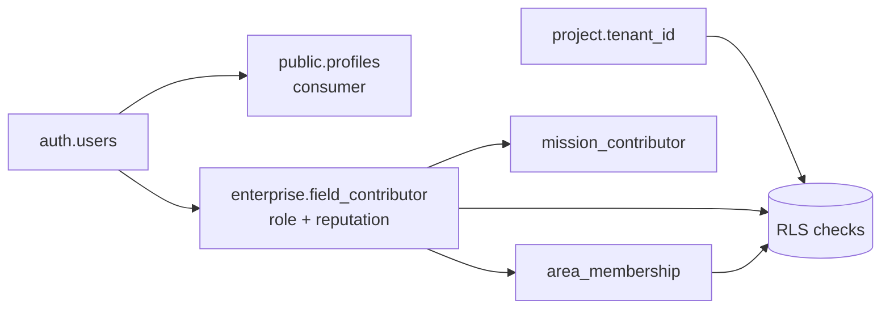
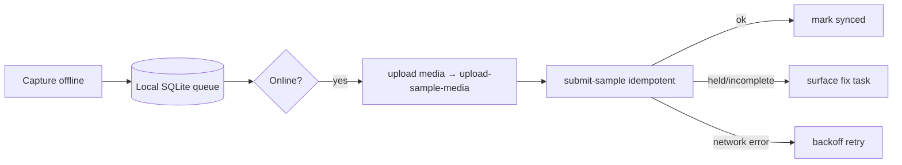

# Luul Scan Enterprise — Phase 1 Engineering Specification v1.0

| | |
|---|---|
| **Implements** | [Architecture v1.0](./LuulScan-Enterprise-Architecture-v1.md) + [Addendum A1](./LuulScan-Enterprise-Architecture-v1-Addendum.md) |
| **Phase** | 1 — Enterprise data foundation only |
| **Status** | Implementation-ready specification (pre-code) |
| **Author role** | Senior Supabase architect · PostgreSQL/PostGIS engineer · RN backend-integration engineer |
| **Golden rule** | Enterprise is an **additive module**. Consumer features (Gem Collector, Gem Explorer, AI identification, valuation, existing UX) are **untouched**. |

> This is the direct instruction set for the coding phase. It contains **specifications**, not runnable code — the `CREATE …` fragments are illustrative shapes for the migration author. **No migrations are created here; no existing app files are modified.**

**Scope of Phase 1:** schemas, tables, extensions, storage, auth/RLS design, and Edge-Function contracts for the enterprise foundation. **Out of Phase 1:** maps UI, analytics, AI models, DEM/terrain rasters (deferred to later phases; hooks are left in place).

---

## Deliverable 1 — Production database design

### 1.0 Conventions
- **Schemas:** `enterprise`, `geo`, `ml`. Consumer tables stay in their existing schema (`public`), **unchanged**.
- **Identity:** every user maps to `auth.users(id)` (Supabase Auth). A `public.profiles` row already exists for consumers; enterprise adds `field_contributor` keyed to the same `auth.uid`.
- **Keys:** UUID PKs via `gen_random_uuid()` (pgcrypto). Client may supply UUIDs for offline records (idempotent upsert).
- **Timestamps:** `timestamptz`, default `now()`, plus `updated_at` maintained by trigger.
- **Spatial:** `geography(Point,4326)` / `geography(Polygon,4326)`; H3 stored as `text` (H3 string) — portable, no hard dependency on `h3index` type.
- **Enums:** Postgres `ENUM` types under `enterprise` (listed in §1.1).
- **Soft references to consumer:** enterprise never FKs *into* consumer scan tables; the promotion path (arch §5.2) copies validated data across.

### 1.1 Enumerated types (design)

```text
enterprise.area_origin        = (seed, user)
enterprise.area_status        = (new, community, verified, archived)
enterprise.verification_state = (unverified, community_confirmed, expert_verified, lab_verified)
enterprise.terrain_type       = (mountain, wadi_river, plateau, coastal, desert, outcrop, other)
enterprise.contributor_role   = (normal, field_contributor, team_leader, enterprise_customer, admin)
enterprise.project_visibility = (private, team, public)
enterprise.mission_status     = (planned, active, paused, completed, archived)
enterprise.sample_status      = (submitted, community_confirmed, expert_verified, lab_verified, held, rejected)
enterprise.completeness       = (incomplete, complete)
enterprise.media_role         = (context, surface_closeup, texture_structure, key_feature, scale_reference, extra)
enterprise.gps_source         = (gps, fused, network, manual)
enterprise.obs_method         = (field, ai, expert)
enterprise.evidence_type      = (visible_gold, historical_mining, previous_exploration, lab_assay, drill_result, gov_academic_reference, community_report)
enterprise.review_decision    = (confirm, dispute, reject)
```

---

### 1.2 `enterprise` schema — core tables

#### `enterprise.field_contributor`
**Purpose:** enterprise profile for a user who collects field data; holds reputation and role.

| Column | Type | Constraints | Notes |
|---|---|---|---|
| id | uuid | PK, default gen_random_uuid() | |
| user_id | uuid | NOT NULL | → `auth.users(id)` |
| role | enterprise.contributor_role | NOT NULL, default 'normal' | RBAC |
| training_level | smallint | default 0 | 0=untrained |
| home_region | text | | |
| reputation_score | numeric(6,2) | NOT NULL, default 50.00 | 0..100, §11.3 |
| status | text | NOT NULL, default 'active' | active/suspended |
| created_at / updated_at | timestamptz | default now() | |

- **PK:** `id` · **FK:** `user_id → auth.users(id)` ON DELETE CASCADE · **Unique:** `user_id`
- **Indexes:** unique(user_id); btree(role); btree(reputation_score)
- **RLS:** a contributor reads/updates **their own** row (non-privileged fields); `role`/`reputation_score` writable only by `admin` (or service role via Edge Fn).

#### `enterprise.project`
**Purpose:** tenancy + visibility grouping for missions/areas (enables private enterprise data).

| Column | Type | Constraints | Notes |
|---|---|---|---|
| id | uuid | PK | |
| name | text | NOT NULL | |
| owner_id | uuid | NOT NULL | → auth.users(id) |
| tenant_id | uuid | NOT NULL | logical tenant |
| visibility | enterprise.project_visibility | NOT NULL, default 'private' | |
| created_at/updated_at | timestamptz | default now() | |

- **PK:** id · **FK:** owner_id → auth.users(id) · **Indexes:** btree(tenant_id), btree(owner_id)
- **RLS:** members of `tenant_id` read; owner/`team_leader`/`admin` write. `public` projects readable by authenticated users.

#### `enterprise.exploration_area`
**Purpose:** named, bounded region of interest (seed or user-created).

| Column | Type | Constraints | Notes |
|---|---|---|---|
| id | uuid | PK | |
| name | text | NOT NULL | |
| region / district | text | | |
| description | text | | |
| terrain_type | enterprise.terrain_type | | |
| geological_notes | text | | |
| origin | enterprise.area_origin | NOT NULL, default 'user' | |
| creator_id | uuid | | → auth.users(id) |
| project_id | uuid | | → project(id), NULL = community/public |
| center | geography(Point,4326) | NOT NULL | |
| boundary | geography(Polygon,4326) | | drawn or derived |
| altitude_m | double precision | | |
| gps_accuracy_m | double precision | | |
| h3_center | text | | H3 of center for fast bucketing |
| status | enterprise.area_status | NOT NULL, default 'new' | lifecycle |
| confidence_score | numeric(5,2) | default 0 | derived |
| verification_status | enterprise.verification_state | default 'unverified' | derived |
| created_at/updated_at | timestamptz | default now() | |

- **PK:** id · **FK:** creator_id → auth.users(id); project_id → project(id)
- **Unique:** none hard (near-duplicate handled by Edge Fn, §4.1); optional partial unique on `(lower(name), district)` for seed data
- **Indexes:** **GIST(center)**, **GIST(boundary)**, btree(status), btree(project_id), btree(h3_center)
- **RLS:** public/community areas (`project_id IS NULL`) readable by authenticated users; project areas readable within tenant. Insert by any authenticated user (community) or project member. Update by creator/`team_leader`/`admin`.

#### `enterprise.area_membership`
**Purpose:** who may contribute to a private area/project.

| Column | Type | Constraints |
|---|---|---|
| area_id | uuid | NOT NULL → exploration_area(id) |
| user_id | uuid | NOT NULL → auth.users(id) |
| role | enterprise.contributor_role | NOT NULL |
| added_at | timestamptz | default now() |

- **PK:** `(area_id, user_id)` · **FK:** both · **Indexes:** btree(user_id)
- **RLS:** readable by members; managed by `team_leader`/`admin`.

#### `enterprise.exploration_mission`
**Purpose:** goal-driven collection campaign.

| Column | Type | Constraints | Notes |
|---|---|---|---|
| id | uuid | PK | |
| name / description | text | name NOT NULL | |
| owner_id | uuid | NOT NULL | → auth.users(id) |
| project_id | uuid | | → project(id) |
| target_observation_count | integer | default 0 | |
| target_coverage_pct | numeric(5,2) | default 0 | |
| starts_at / ends_at | timestamptz | | |
| status | enterprise.mission_status | NOT NULL, default 'planned' | |
| created_at/updated_at | timestamptz | default now() | |

- **PK:** id · **FK:** owner_id, project_id · **Indexes:** btree(status), btree(project_id)
- **RLS:** tenant/project-scoped; create/manage by `team_leader`/`enterprise_customer`/`admin`.

#### `enterprise.mission_area`  (M:N)
| Column | Type | Constraints |
|---|---|---|
| mission_id | uuid | NOT NULL → exploration_mission(id) |
| area_id | uuid | NOT NULL → exploration_area(id) |
- **PK:** `(mission_id, area_id)` · **Indexes:** btree(area_id) · **RLS:** follows mission.

#### `enterprise.mission_contributor`  (roster)
| Column | Type | Constraints |
|---|---|---|
| mission_id | uuid | NOT NULL → exploration_mission(id) |
| contributor_id | uuid | NOT NULL → auth.users(id) |
| role | enterprise.contributor_role | NOT NULL |
| added_at | timestamptz | default now() |
- **PK:** `(mission_id, contributor_id)` · **Indexes:** btree(contributor_id) · **RLS:** member-readable; managed by team lead.

#### `enterprise.sample`
**Purpose:** the atomic field-evidence unit.

| Column | Type | Constraints | Notes |
|---|---|---|---|
| id | uuid | PK (client-suppliable) | offline UUID |
| area_id | uuid | NOT NULL → exploration_area(id) | |
| mission_id | uuid | → exploration_mission(id) | nullable |
| collector_id | uuid | NOT NULL → auth.users(id) | |
| collected_at | timestamptz | NOT NULL | device time |
| host_context | text | | |
| rock_condition | text | | A1.1 metadata |
| in_situ | boolean | | in-situ vs transported |
| geological_environment | text | | |
| terrain_type | enterprise.terrain_type | | |
| weather_conditions | text | | optional |
| field_observations | text | | |
| status | enterprise.sample_status | NOT NULL, default 'submitted' | trust ladder |
| completeness_status | enterprise.completeness | NOT NULL, default 'incomplete' | A1.1 gate |
| gps_accuracy_score | numeric(5,2) | | derived |
| image_quality_score | numeric(5,2) | | derived (min across required roles) |
| field_reliability_score | numeric(5,2) | | A1.2 device trust |
| confidence_score | numeric(5,2) | default 0 | blended |
| created_at/updated_at | timestamptz | default now() | |

- **PK:** id · **FK:** area_id, mission_id, collector_id
- **Indexes:** btree(area_id), btree(mission_id), btree(collector_id), btree(status), btree(collected_at) — consider **monthly partition** by `collected_at` at scale
- **RLS:** collector reads own; community-visible once `status ≥ community_confirmed` for community areas; project samples tenant-scoped. Writes via `submit-sample` Edge Fn (service role) — direct client insert **disabled** to enforce validation.

#### `enterprise.sample_location`  (1:1 sample)
| Column | Type | Constraints | Notes |
|---|---|---|---|
| sample_id | uuid | PK → sample(id) | |
| location | geography(Point,4326) | NOT NULL | |
| altitude_m | double precision | | |
| gps_accuracy_m | double precision | | |
| h3_cell | text | NOT NULL | working resolution |
| provenance | enterprise.gps_source | NOT NULL | |
- **PK:** sample_id · **FK:** sample_id ON DELETE CASCADE · **Indexes:** **GIST(location)**, btree(h3_cell) · **RLS:** mirrors `sample`.

#### `enterprise.sample_media`
**Purpose:** images per sample, tagged by protocol role (A1.1).

| Column | Type | Constraints | Notes |
|---|---|---|---|
| id | uuid | PK | |
| sample_id | uuid | NOT NULL → sample(id) | |
| role | enterprise.media_role | NOT NULL | A1.1 5 roles |
| is_required | boolean | NOT NULL, default true | |
| storage_path | text | NOT NULL | bucket key |
| thumb_path | text | | |
| image_quality_score | numeric(5,2) | | |
| retake_requested | boolean | default false | |
| width / height | integer | | |
| exif | jsonb | | |
| created_at | timestamptz | default now() | |
- **PK:** id · **FK:** sample_id ON DELETE CASCADE · **Unique:** `(sample_id, role)` for required roles (one per role) · **Indexes:** btree(sample_id) · **RLS:** mirrors `sample`; storage objects protected separately (§2.3).

#### `enterprise.sample_device_context`  (1:1 sample, A1.2)
| Column | Type | Constraints | Notes |
|---|---|---|---|
| sample_id | uuid | PK → sample(id) | |
| device_id | text | | app-scoped |
| app_version | text | | |
| os | text | | e.g. "Android 16" |
| gps_source | enterprise.gps_source | | |
| capture_timestamp | timestamptz | | device clock |
| mock_location | boolean | default false | trust signal |
| offline_capture | boolean | default false | |
| sync_timestamp | timestamptz | | server arrival |
- **PK:** sample_id · **FK:** ON DELETE CASCADE · **Indexes:** btree(device_id) · **RLS:** collector/admin read; written by Edge Fn.

#### `enterprise.rock_observation`
| Column | Type | Constraints | Notes |
|---|---|---|---|
| id | uuid | PK | |
| sample_id | uuid | NOT NULL → sample(id) | |
| rock_class | text | | |
| host_type | text | | |
| texture | text | | |
| weathering | text | | |
| vein_presence | boolean | | |
| notes | text | | |
| method | enterprise.obs_method | NOT NULL, default 'field' | field/ai/expert |
| created_at | timestamptz | default now() | |
- **PK:** id · **FK:** sample_id ON DELETE CASCADE · **Indexes:** btree(sample_id), btree(rock_class) · **RLS:** mirrors sample.

#### `enterprise.mineral_observation`
| Column | Type | Constraints | Notes |
|---|---|---|---|
| id | uuid | PK | |
| sample_id | uuid | NOT NULL → sample(id) | |
| mineral | text | | |
| indicator_flags | jsonb | | pathfinders |
| method | enterprise.obs_method | NOT NULL, default 'field' | |
| confidence | numeric(5,2) | | |
| created_at | timestamptz | default now() | |
- **PK:** id · **FK:** sample_id ON DELETE CASCADE · **Indexes:** btree(sample_id), btree(mineral) · **RLS:** mirrors sample.

---

### 1.3 `enterprise` schema — trust & evidence tables

#### `enterprise.verification_record`
**Purpose:** each review action on a sample or occurrence evidence.

| Column | Type | Constraints | Notes |
|---|---|---|---|
| id | uuid | PK | |
| subject_type | text | NOT NULL | 'sample' \| 'occurrence' |
| subject_id | uuid | NOT NULL | polymorphic (see note) |
| reviewer_id | uuid | NOT NULL → auth.users(id) | |
| level | text | NOT NULL | 'community' \| 'expert' |
| decision | enterprise.review_decision | NOT NULL | |
| weight | numeric(5,2) | NOT NULL | reputation-weighted |
| note | text | | |
| created_at | timestamptz | default now() | |
- **PK:** id · **FK:** reviewer_id · **Indexes:** btree(subject_type, subject_id), btree(reviewer_id) · **Unique:** `(subject_type, subject_id, reviewer_id, level)` (one vote per reviewer per level)
- **Note:** polymorphic subject kept simple; integrity enforced in Edge Fn. **RLS:** authenticated can insert `community`; only expert/admin insert `expert`.

#### `enterprise.evidence_tier`  (lookup)
**Purpose:** maps evidence_type → reliability tier + weight (drives AI label eligibility).

| Column | Type | Constraints | Notes |
|---|---|---|---|
| evidence_type | enterprise.evidence_type | PK | |
| tier | text | NOT NULL | 'highest' \| 'medium' \| 'lower' |
| weight | numeric(5,2) | NOT NULL | |
| ai_label_eligible | boolean | NOT NULL | only 'highest' = true |
- **PK:** evidence_type · **Seed rows:** lab_assay/drill_result → highest(eligible); historical_mining/expert(via obs) → medium; visible_gold/community_report → lower · **RLS:** read-all; write admin only.

#### `enterprise.occurrence_evidence`  (A1.3)
| Column | Type | Constraints | Notes |
|---|---|---|---|
| id | uuid | PK | |
| exploration_area_id | uuid | NOT NULL → exploration_area(id) | required |
| sample_id | uuid | → sample(id) | optional |
| evidence_type | enterprise.evidence_type | NOT NULL | → evidence_tier |
| description | text | | |
| source | text | | citation/lab/agency |
| confidence_score | numeric(5,2) | default 0 | derived from tier + verification |
| verification_status | enterprise.verification_state | default 'unverified' | own ladder |
| verified_by | uuid | → auth.users(id) | nullable |
| created_at | timestamptz | default now() | |
- **PK:** id · **FK:** exploration_area_id, sample_id, evidence_type→evidence_tier, verified_by
- **Indexes:** btree(exploration_area_id), btree(sample_id), btree(evidence_type), btree(verification_status)
- **RLS:** community-area evidence readable by authenticated; project evidence tenant-scoped; `lab_assay`/`drill_result` insert gated to expert/admin/accredited.

#### `enterprise.lab_result`
| Column | Type | Constraints | Notes |
|---|---|---|---|
| id | uuid | PK | |
| sample_id | uuid | NOT NULL → sample(id) | |
| lab_name | text | | |
| assay | jsonb | | element grades |
| grade_gpt | numeric(10,3) | | g/t (headline) |
| accredited | boolean | default false | |
| received_at | timestamptz | default now() | |
- **PK:** id · **FK:** sample_id · **Indexes:** btree(sample_id), btree(accredited) · **RLS:** insert expert/admin; read follows sample/tenant.

---

### 1.4 `geo` schema

#### `geo.geological_layer`
**Purpose:** curated geological polygons/lines (formations, faults, belts).

| Column | Type | Constraints | Notes |
|---|---|---|---|
| id | uuid | PK | |
| name | text | NOT NULL | |
| kind | text | NOT NULL | formation/fault/lithology/greenstone_belt/… |
| geom | geometry(Geometry, 4326) | NOT NULL | mixed geometry OK |
| source | text | | public-domain citation |
| attributes | jsonb | | |
- **PK:** id · **Indexes:** **GIST(geom)**, btree(kind) · **RLS:** read-all authenticated; write admin.

#### `geo.coverage_cell`  (materialized aggregate)
**Purpose:** H3 sampling density per area (coverage intelligence §12).

| Column | Type | Constraints | Notes |
|---|---|---|---|
| area_id | uuid | NOT NULL → exploration_area(id) | |
| h3 | text | NOT NULL | cell id |
| resolution | smallint | NOT NULL | working res |
| sample_count | integer | default 0 | |
| verified_count | integer | default 0 | |
| last_sampled_at | timestamptz | | |
| density_band | text | | none/low/medium/high |
| geom | geometry(Polygon,4326) | | cell boundary (cached) |
- **PK:** `(area_id, h3)` · **Indexes:** btree(area_id), btree(h3), GIST(geom) · **Refresh:** `pg_cron` / after ingestion · **RLS:** read follows area.

**H3 indexing support:** H3 stored as `text` on `sample_location.h3_cell` and `coverage_cell.h3`. If the `h3`/`h3-pg` extension is available, add generated columns / helper functions; otherwise compute H3 **client-side and in Edge Functions** and store the string (chosen default — no hard extension dependency).

---

### 1.5 `ml` schema (preparation tables only — **no models**)

#### `ml.ml_feature`
| Column | Type | Constraints | Notes |
|---|---|---|---|
| entity_type | text | NOT NULL | 'area' \| 'cell' \| 'sample' |
| entity_id | text | NOT NULL | |
| features | jsonb | NOT NULL | feature vector |
| computed_at | timestamptz | default now() | |
- **PK:** `(entity_type, entity_id, computed_at)` · **Indexes:** btree(entity_type, entity_id) · **RLS:** service/admin only.

#### `ml.ml_model`
| Column | Type | Constraints |
|---|---|---|
| id | uuid | PK |
| name / kind / version | text | NOT NULL |
| metrics | jsonb | |
| trained_at | timestamptz | |
| status | text | draft/active/retired |
- **PK:** id · **Unique:** `(name, version)` · **RLS:** admin only. *(Placeholder — populated in Phase 6.)*

#### `ml.ml_score`
| Column | Type | Constraints | Notes |
|---|---|---|---|
| id | uuid | PK | |
| model_id | uuid | → ml_model(id) | |
| entity_type / entity_id | text | NOT NULL | |
| score | numeric(6,3) | | |
| probability | numeric(5,4) | | calibrated |
| explanation | jsonb | | contributing features |
| scored_at | timestamptz | default now() | |
- **PK:** id · **Indexes:** btree(entity_type, entity_id), btree(model_id) · **RLS:** read follows entity; write service only.

---

## Deliverable 2 — Supabase setup plan

### 2.1 Required PostgreSQL extensions

| Extension | Why required |
|---|---|
| **postgis** | Geometry/geography types, spatial predicates & GIST indexes — the core of areas, samples, layers, coverage. |
| **pgcrypto** | `gen_random_uuid()` for server-side UUIDs; hashing where needed. |
| **uuid-ossp** *(optional)* | Alt UUID generation if preferred; pgcrypto is sufficient. |
| **h3 / h3-pg** *(optional)* | Native H3 indexing if available on the plan; **fallback = compute H3 in app/Edge Fn and store text** (no hard dependency). |
| **postgis_raster** *(deferred)* | DEM/terrain — **not** Phase 1; enable when terrain analysis lands. |
| **pg_cron** | Scheduled refresh of `coverage_cell`, `mission_progress`, confidence recompute. |

### 2.2 Database bootstrap order
1. Enable extensions → 2. create schemas (`enterprise`, `geo`, `ml`) → 3. create enum types → 4. create tables (parents → children) → 5. indexes → 6. RLS enable + policies → 7. seed (`evidence_tier`, seed areas: Cal Miskaad, Cal Madow, Karkaar, Milxa) → 8. `pg_cron` jobs.

### 2.3 Storage architecture (buckets)

| Bucket | Purpose | Access rules | Naming convention |
|---|---|---|---|
| **sample-media** | Original field images (private) | No public read; access via signed URLs; write via `upload-sample-media` Edge Fn only | `sample-media/{area_id}/{sample_id}/{role}-{media_id}.jpg` |
| **sample-thumbnails** | Derived thumbs for lists/maps | Signed URLs; generated server-side | `sample-thumbnails/{area_id}/{sample_id}/{media_id}.jpg` |
| **exports** | Tenant-scoped licensed dataset exports | Private; signed URL to owning tenant only; short TTL | `exports/{tenant_id}/{export_id}.zip` |

- All buckets **private**. RLS-style storage policies key off the object path prefix (`area_id`/`tenant_id`) and the caller's membership.
- Originals are never public; the app requests **signed URLs** with short expiry.

---

## Deliverable 3 — Authentication & security

### 3.1 Identity model
- **Supabase Auth** (`auth.users`) is the single identity. Consumer `public.profiles` stays as-is.
- **Enterprise profile** = `enterprise.field_contributor` (1:1 with `auth.users`), carrying `role` + `reputation_score`.
- **Permissions** derive from: `field_contributor.role` + `area_membership` + `project`/`tenant_id`. A JWT custom claim (`app_role`) may mirror `role` for fast policy checks (kept in sync by an Auth hook / Edge Fn).



### 3.2 Roles
`normal user` · `field contributor` · `team leader` · `enterprise customer` · `admin` (see Architecture §8 for the permission matrix). Role stored on `field_contributor.role`; elevation only by `admin`/service role.

### 3.3 Row Level Security — policy design

**Consumer:** **unchanged.** No new policies touch consumer tables. (Explicit non-goal.)

**Enterprise (per surface):**

| Surface | Read | Write |
|---|---|---|
| **Public/community areas & their confirmed samples** | any authenticated user | insert area: any authenticated; insert sample: via `submit-sample` (service role) after gate; update area: creator/team_leader/admin |
| **Private enterprise projects** | members of `project.tenant_id` only | project members with role ≥ contributor; managed by team_leader/enterprise_customer |
| **Contributor access** | own contributor row; own samples always; others' samples only when `status ≥ community_confirmed` (community) or same tenant (private) | own contributor row (non-privileged fields) |
| **Verification access** | reviewers see items in their scope | insert `community` verification: any authenticated (weighted); insert `expert` verification + `lab_result` + high-tier `occurrence_evidence`: expert/admin only |

**Enforcement principle:** **all enterprise writes flow through Edge Functions (service role)** that validate first; RLS is the **backstop**, not the sole gate. Direct client `INSERT` on `sample`/`sample_media`/`occurrence_evidence` is disabled.

---

## Deliverable 4 — Edge Functions specification

> All functions: run with **service role**, require a valid user JWT (except none are public), validate input with a schema, are **idempotent** on client-supplied UUIDs, and return `{ ok, data?, error? }`.

### 4.1 `create-exploration-area`
- **Purpose:** create a user area with GPS + H3 + duplicate detection.
- **Auth:** authenticated user (any). For project areas: project membership.
- **Input:** `{ name, region, district, description, terrain_type, geological_notes, center:{lat,lng}, altitude_m, gps_accuracy_m, project_id? }`
- **Validation:** required fields; `gps_accuracy_m` within sane bound; **dedupe** — reject/merge if an area with similar name exists within R metres (`ST_DWithin` on `center`) → return existing `area_id` with `duplicate:true`.
- **DB actions:** compute `h3_center`; insert `exploration_area` (`origin='user'`, `status='new'`).
- **Response:** `{ ok, area_id, status, duplicate? }`.

### 4.2 `submit-sample`
- **Purpose:** accept a completed field sample (usually from the offline queue).
- **Auth:** authenticated **field_contributor**; area/project membership for private areas.
- **Input:** `{ sample_id(uuid), area_id, mission_id?, collected_at, metadata{...}, location{lat,lng,alt,accuracy,source}, device_context{...}, media[{media_id, role, storage_path, quality_score, width, height}], rock_observation?, mineral_observation? }`
- **Validation:** GPS accuracy within threshold; **image completeness** — all required `media_role`s present and each `quality_score ≥ min`; **device trust** — mock_location, impossible-travel vs contributor's last sample, duplicate detection.
- **DB actions:** compute `gps_accuracy_score`, `image_quality_score`, `field_reliability_score`, blended `confidence_score`; set `completeness_status`; set `status` (`submitted`, or `held` if trust fails); insert `sample` + `sample_location` (with `h3_cell`) + `sample_device_context` + observations; **upsert** by `sample_id` (idempotent for retries).
- **Response:** `{ ok, sample_id, status, scores, missing_roles? }`.

### 4.3 `upload-sample-media`
- **Purpose:** validate + store one image for a sample role.
- **Auth:** authenticated field_contributor (owner of the sample/offline batch).
- **Input:** multipart or signed-upload handshake: `{ sample_id, media_id, role, image }`.
- **Validation:** **role** valid & not duplicated (one per required role); **quality scoring** (blur/exposure/resolution/subject) → reject with `retake` if below threshold.
- **DB actions:** compress + generate **thumbnail**; write original to `sample-media`, thumb to `sample-thumbnails`; insert/upsert `sample_media` (`storage_path`, `thumb_path`, `image_quality_score`).
- **Response:** `{ ok, media_id, storage_path, quality_score, retake_requested }`.

### 4.4 `submit-verification`
- **Purpose:** record a community/expert verification, reputation-weighted, honoring the evidence hierarchy.
- **Auth:** authenticated (community) or expert/admin (expert level).
- **Input:** `{ subject_type:'sample'|'occurrence', subject_id, level, decision, note? }`.
- **Validation:** reviewer not the collector (no self-verify); one vote per reviewer/level (unique); expert level requires expert/admin role; for occurrence, evidence tier respected.
- **DB actions:** insert `verification_record` with `weight = f(reviewer.reputation_score)`; recompute subject `status`/`verification_status` from weighted tally + tier; adjust collector reputation on final outcome; enqueue `calculate-area-confidence`.
- **Response:** `{ ok, new_status, weighted_score }`.

### 4.5 `calculate-area-confidence`
- **Purpose:** (re)derive an area's confidence + lifecycle status.
- **Auth:** service role (invoked by triggers/cron/other fns); admin manual.
- **Input:** `{ area_id }`.
- **Validation:** area exists.
- **DB actions:** aggregate **verified samples**, **coverage** (`coverage_cell` — cells with ≥N samples over target), and **best-tier verified `occurrence_evidence`**; compute `confidence_score`; advance `status` New→Community→Verified per §11.4 thresholds; write back to `exploration_area`.
- **Response:** `{ ok, area_id, confidence_score, status }`.

**Supporting (scheduled):** `refresh-coverage` and `refresh-mission-progress` (via `pg_cron`) maintain `coverage_cell` and `mission_progress`.

---

## Deliverable 5 — Mobile app integration plan (architecture only)

### 5.1 Navigation (additive)
The enterprise module is a **new top-level tab**, isolated from consumer flows:

```text
Luul Scan
├── Scan            (consumer — UNCHANGED: Gem Collector / Explorer, AI id, valuation)
├── Explorer        (consumer — UNCHANGED)
└── Field Mission   (NEW — enterprise module, visible only to field_contributor+)
```

The Field Mission tab renders **only** when the signed-in user has an enterprise role; otherwise the app is byte-for-byte the current consumer experience.

### 5.2 Screens (described, no UI code)

| Screen | Responsibility | Talks to |
|---|---|---|
| **Exploration Areas** | List/browse areas (mine, community, mission), map/list toggle | read `exploration_area`, `coverage_cell` |
| **Create Area** | Capture GPS + metadata; submit | `create-exploration-area` |
| **Capture Sample** | Guided 5-role capture (reuses Smart Capture), metadata, quality gate | `upload-sample-media`, queue → `submit-sample` |
| **Mission Tasks** | Assigned cells/targets, progress, suggested next cell | read mission + `mission_progress`, `coverage_cell` |
| **Offline Queue** | Pending samples/media captured offline | local DB (§6) |
| **Sync Status** | Sync progress, failures, retries | sync engine (§6) |
| **Contributor Profile** | Role, reputation, contributions, trust standing | read `field_contributor` |

### 5.3 Integration boundaries
- **No shared state** with consumer scan orchestration; enterprise uses its own data-access layer + Edge Functions.
- Consumer→enterprise only via explicit **promotion** (arch §5.2), never automatic.

---

## Deliverable 6 — Offline field architecture

### 6.1 Local storage choice

| Option | Pros | Cons |
|---|---|---|
| **Expo SQLite** | First-party, works in the current Expo (SDK 51) setup, no config-plugin friction, full SQL | Manual schema/query layer |
| WatermelonDB | Reactive, fast at scale, sync primitives | Heavier setup, native config, opinionated |
| Raw SQLite (other) | — | Reinvents Expo SQLite |

**Recommendation: Expo SQLite.** It fits the existing Expo/RN 0.74 stack with **no new native config risk**, gives full SQL for the queue + spatial-lite needs, and keeps the offline layer simple. (WatermelonDB is a Phase-3+ option if reactive sync at large scale becomes necessary.)

### 6.2 Offline model & sync

- **Local schema (mirror subset):** `pending_area`, `pending_sample`, `pending_media`, `sync_log`.
- **UUID generation:** client generates `sample_id`/`media_id`/`area_id` (v4) **at capture** → same id server-side (idempotent upsert) → no duplicates on retry.
- **Local queue:** captures enqueue with `status = pending`; media files stored in app document dir, referenced by local path.
- **Retry system:** exponential backoff; per-item retry count; poison-item quarantine after N failures with user-visible error.
- **Conflict handling:** server is authoritative for derived fields (scores/status). Client rows are **immutable field observations** (append-only), so conflicts are rare; on `409`/validation error the item is flagged for user review (e.g., "retake role 3"), not silently dropped.
- **Sync process:**



- **Sync triggers:** on connectivity regain (NetInfo), on app foreground, and manual "Sync now".

---

## Deliverable 7 — Implementation order (sprints)

| Sprint | Focus | Output |
|---|---|---|
| **1 — Supabase foundation** | Enable extensions, create `enterprise`/`geo`/`ml` schemas, enum types | Empty foundation, consumer untouched |
| **2 — Database tables** | Create all Phase-1 tables + indexes + seed (`evidence_tier`, seed areas) | Schema live (author writes the migrations here — first code) |
| **3 — Auth & RLS** | `field_contributor` provisioning, role claim sync, RLS policies for every enterprise surface | Secure data access verified by tests |
| **4 — Exploration Areas** | `create-exploration-area` Edge Fn + read APIs; H3 tagging | Users create/list areas |
| **5 — Sample collection** | `upload-sample-media` + `submit-sample` + verification/confidence fns | Samples captured, scored, verified |
| **6 — Offline sync** | Expo SQLite queue, UUIDs, retry, sync engine | Reliable field capture offline→online |
| **7 — Maps** | Area/sample/coverage map rendering (read-only from Phase-1 data) | Teams see data spatially |

**Gate:** Sprints 1–3 must pass an isolation test proving **zero behavioral change** to consumer features before enterprise write paths go live.

---

## Deliverable 8 — Risk review before coding

### 8.1 Missing decisions (resolve before Sprint 2)
1. **H3 resolution** for field work (edge length) — pick one working res + roll-up levels.
2. **Score formulas** — exact weightings for `field_reliability_score` and blended `confidence_score` (owned by data-science, tunable via a config table).
3. **Lifecycle thresholds** — concrete N/M/K for New→Community→Verified.
4. **Tenant model** — is `tenant_id` = org, and how are enterprise customers provisioned?
5. **Role-claim sync** — Auth hook vs Edge Fn for mirroring `role` into JWT.
6. **Dedupe radius R** for near-duplicate areas.
7. **Media retention** policy + max images/sample.

### 8.2 Technical risks
- **PostGIS/H3 query performance** at volume → GIST + BRIN, partition `sample` by month, materialize `coverage_cell`.
- **Polymorphic `verification_record`** integrity → enforce in Edge Fn + check constraints; consider split tables if it complicates RLS.
- **Offline idempotency** edge cases → strict client-UUID + upsert; dedupe on `(collector_id, location, collected_at)` as a guard.
- **RLS complexity** → keep writes in Edge Functions; RLS as backstop; comprehensive policy test suite.

### 8.3 Cost risks
- **Image storage growth** (5+ images/sample) → thumbnails + tiered/retention; on-device compression before upload.
- **Edge Function invocations** (per media + per sample) → batch where possible; signed direct-to-storage upload to cut function egress.
- **Compute for scoring/coverage** → move heavy aggregation to `pg_cron`/materialized views, not request path.

### 8.4 Supabase limitations to plan around
- **Edge Function** execution time/memory limits → keep image processing lean; offload heavy jobs to scheduled workers.
- **`h3-pg` availability** may vary by plan → **default to app/Edge-computed H3 string** (no hard dependency).
- **Storage signed-URL** management + policy granularity → path-prefix conventions (§2.3).
- **Connection limits** at scale → pooling (Supavisor), read replicas for analytics.
- **`pg_cron`/extension availability** → confirm enabled on the chosen plan.

### 8.5 Expo / React Native limitations
- **Native module footprint** — prefer first-party (**Expo SQLite**, existing camera/location) to protect the current local build recipe (JDK 17 + committed `android/`); avoid libraries needing risky native config.
- **Background sync** constraints on Android/iOS → sync on foreground/connectivity events, not guaranteed background.
- **Large local media** handling → store files in document dir, reference by path; avoid base64 in SQLite.
- **Android 16 (targetSdk 36)** edge-to-edge + permissions behavior → validate insets and location/camera permission flows on device.

---

## Final confirmation

**Luul Scan Enterprise Phase 1 Engineering Specification v1.0** is complete and implementation-ready. It converts the approved architecture (v1.0 + Addendum A1) into concrete tables, extensions, storage, auth/RLS, Edge-Function contracts, mobile integration boundaries, an offline strategy, a sprint order, and a pre-coding risk review — while guaranteeing the **consumer app remains untouched**.

**This document is a specification only. No code, migrations, or app changes are included — those begin in Sprint 1/2 under this spec.**

---

*End of Phase 1 Engineering Specification v1.0.*
