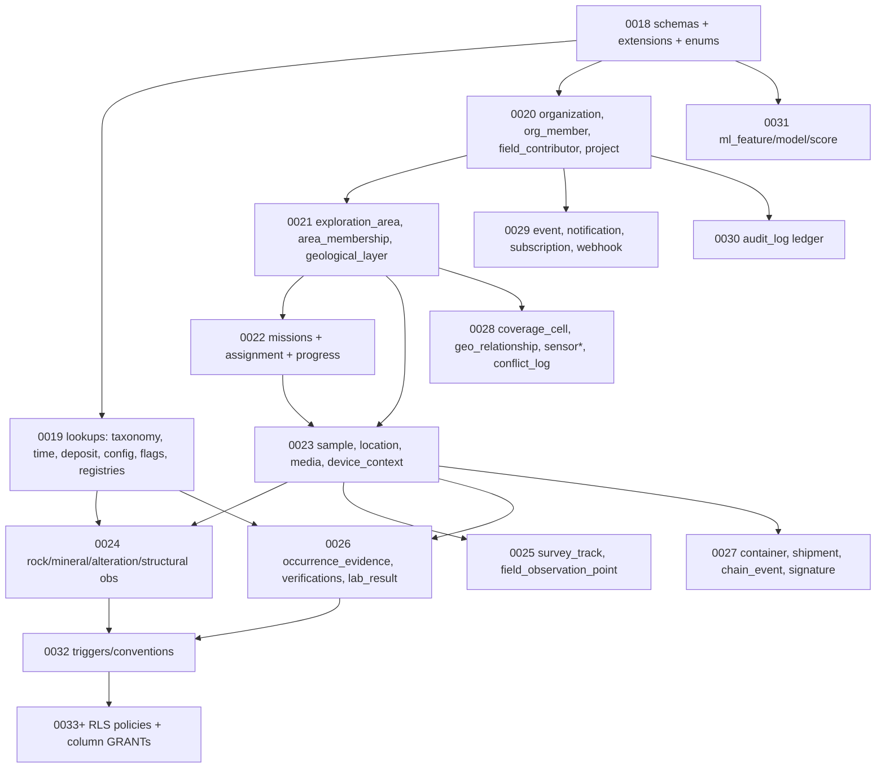

# Luul Scan Enterprise — Sprint 1 Implementation Plan

| | |
|---|---|
| **Baseline** | commit `368ae00` · tag `enterprise-architecture-v1.0` |
| **Built to** | Architecture v1.0 · A1 · A2 · A3 · Phase 1 Engineering Spec |
| **Sprint 1 scope** | **Supabase foundation only** — schemas + extensions + enum types (migration `0018`) |
| **Status** | **Plan for review.** No migrations/SQL/code produced yet. Migrations begin only after this plan is approved. |

> Sprint 1 lays the *empty foundation*: three schemas, two extensions, and all enum types. **No tables, no RLS, no functions, no app code.** It must be verified (and consumer app proven unchanged) before Sprint 2 creates tables.

---

## 1. Sprint 1 goal & exact scope

**Deliverable:** one additive migration **`0018_enterprise_foundation.sql`** that:

1. Creates schemas: `enterprise`, `geo`, `ml`.
2. Enables extensions: `postgis`, `pgcrypto` — **only these two** (no h3-pg, no postgis_raster, no ltree in Sprint 1).
3. Creates **all enum types** (from Phase-1 Spec §1.1 + A2.1 + A3.1) in `enterprise`.
4. Grants baseline `usage` on the new schemas to the appropriate roles (no table grants yet).

**Explicitly NOT in Sprint 1:** tables, indexes, RLS, triggers, storage buckets, Edge Functions, config.toml API-exposure, app changes. Those are Sprints 2–7.

---

## 2. Extension order & rationale

| Order | Extension | Why | Notes |
|---|---|---|---|
| 1 | `pgcrypto` | `gen_random_uuid()` for all UUID PKs | Verify it resolves (Supabase provides it; confirm schema/search_path) |
| 2 | `postgis` | geography/geometry types + GIST — needed before any geo column (Sprint 2) | Heavyweight; enable once, early |

**Deferred extensions (later phases, not Sprint 1):** `postgis_raster` (Phase 4 raster ingestion), `h3-pg` (optional; default is app/Edge-computed H3 text), `pg_cron` (Sprint 5 scheduled jobs), `pg_trgm` already present (search, later).

**Pre-flight check (blocking):** confirm `postgis` is available/enabled on the target Supabase plan **before** running `0018` (Validation R1). If not, resolve with Supabase before proceeding.

---

## 3. Enum types to create in `0018` (complete list)

From Phase-1 Spec §1.1:
`area_origin · area_status · verification_state · terrain_type · contributor_role · project_visibility · mission_status · sample_status · completeness · media_role · gps_source · obs_method · evidence_type · review_decision`

From A2.1:
`org_role · audit_action · finding_type · sample_method · alteration_type · alteration_grade · structure_type · assignment_status`

From A3 (no new enum types beyond text lookups — taxonomy/time/deposit are **tables**, not enums).

**Total: 22 enum types.** All in schema `enterprise`. (Values are specified in the referenced docs; the migration author copies them verbatim.)

---

## 4. Full Phase-1 migration order (roadmap)

Sprint 1 is only `0018`. The rest is shown so the team sees the dependency-respecting path. Each migration is **additive** and **idempotent** (`create … if not exists`), never alters `public`.

| Migration | Sprint | Contents | Depends on |
|---|---|---|---|
| **`0018`** | **1** | schemas + `pgcrypto` + `postgis` + all enums | — |
| `0019` | 2 | **Independent lookups** (no FK to enterprise entities): `taxonomy`, `taxonomy_version`, `taxonomy_node`, `taxonomy_alias`, `geologic_time`, `deposit_model`, `evidence_tier`, `config_entry`, `feature_flag`, `raster_layer_registry`, `sensor_type` | 0018 |
| `0020` | 2 | **Identity & org**: `organization`, `organization_member`, `field_contributor`, `project` | 0018; `auth.users` |
| `0021` | 2 | **Geography**: `geological_layer` (geo), `exploration_area`, `area_membership` | 0020 |
| `0022` | 2 | **Missions**: `exploration_mission`, `mission_area`, `mission_contributor`, `mission_assignment`, `mission_progress` | 0021 |
| `0023` | 2 | **Samples**: `sample`, `sample_location`, `sample_media`, `sample_device_context` (partitioned by month) | 0021, 0022 |
| `0024` | 2 | **Observations**: `rock_observation`, `mineral_observation`, `alteration_observation`, `structural_measurement` | 0023, 0019 (taxonomy FKs) |
| `0025` | 2 | **Survey/absence**: `survey_track`, `field_observation_point` | 0023 |
| `0026` | 2 | **Evidence & verification**: `occurrence_evidence`, `sample_verification`, `occurrence_verification`, `lab_result` | 0023, 0019 |
| `0027` | 2 | **Chain of custody**: `sample_container`, `shipment`, `sample_chain_event`, `custody_signature` | 0023, 0020 |
| `0028` | 2 | **Hooks**: `coverage_cell` (geo), `geo_relationship`, `sensor`, `sensor_capture`, `sensor_file`, `conflict_log` | 0021, 0019 |
| `0029` | 2 | **Events/notifications**: `event`, `notification`, `notification_subscription`, `webhook_endpoint` | 0020 |
| `0030` | 2 | **Audit ledger**: `audit_log` (hash-chain columns) | 0020 |
| `0031` | 2 | **ML placeholders**: `ml_feature`, `ml_model`, `ml_score` | 0018 |
| `0032` | 2 | **Triggers**: `enterprise.set_updated_at()` + per-table `updated_at`; `created_by`/`deleted_at` conventions | all above |
| `0033+` | 3 | **RLS**: enable + policies per surface (org/community/private/contributor/verification) + column-level GRANTs (role protection) | all tables |

Storage buckets (Sprint 4) and Edge Functions (Sprint 5) are provisioned outside SQL migrations.

---

## 5. Dependency graph (FK creation order)

**Rule:** never create a child before its parent; every FK target exists first. `auth.users` (existing) is the root for all `*_id` user references.

---

## 6. Rollback strategy

**Per-migration:** each migration ships with a documented **down-path**. Because everything is additive and namespaced:

- **Sprint 1 (`0018`) rollback:** `drop schema enterprise cascade; drop schema geo cascade; drop schema ml cascade;` + `drop extension postgis; drop extension pgcrypto;` **only if** no other object depends on them (pgcrypto may be shared — leave it if so). This fully reverts Sprint 1 with **zero impact** on `public`.
- **Sprint 2+ rollback:** drop the migration's own objects in reverse dependency order (children before parents). Never touch `public`.
- **Whole-Phase-1 emergency rollback:** `drop schema enterprise/geo/ml cascade` + revert any `config.toml` additions. Safe precisely because enterprise is additive & isolated (Validation R3, A2).

**Practice:** run every migration first on a **Supabase branch / local shadow DB**, verify + test the down-path, then apply to production. Never first-run against production data.

---

## 7. Testing strategy

| Layer | Sprint 1 checks | How |
|---|---|---|
| **Migration** | `0018` applies cleanly; re-running is idempotent | apply twice on shadow DB |
| **Extensions** | `postgis`, `pgcrypto` present; `gen_random_uuid()` + `ST_MakePoint` callable | smoke queries |
| **Schemas** | `enterprise`/`geo`/`ml` exist; usage grants correct | catalog query |
| **Enums** | all 22 enum types exist with exact values | `pg_type` inspection vs spec |
| **Rollback** | down-path drops everything; DB returns to pre-`0018` state | apply → rollback → diff |
| **Consumer isolation** | `public.*` unchanged; app builds & runs identically | schema diff of `public`; run existing jest suite (59+ tests) + build |

Later sprints add: RLS isolation matrix (anon/normal/contributor/org/cross-tenant/self-escalation), PostGIS `EXPLAIN` for GIST usage, storage policy tests, Edge-Function contract tests. Captured in `PHASE1_TEST_REPORT.md` (STEP 6).

---

## 8. Acceptance criteria

**Sprint 1 is DONE when:**
1. ✅ `0018` applies on a shadow/branch DB with no errors and is idempotent.
2. ✅ `postgis` + `pgcrypto` enabled; `gen_random_uuid()` and a basic PostGIS function verified.
3. ✅ Schemas `enterprise`/`geo`/`ml` exist with correct `usage` grants.
4. ✅ All **22 enum types** exist with values matching the spec exactly.
5. ✅ Documented **rollback** verified (apply → rollback → clean).
6. ✅ **Consumer proof:** `public` schema byte-identical (no diffs); existing test suite passes; app build unaffected.
7. ✅ Pre-flight decisions resolved: **D1** (API exposure — defer to Sprint 3 read policies), **PostGIS availability confirmed** on the plan, **shadow-DB test path** in place.

**Gate:** Sprint 2 (tables) does not begin until all seven are green and this plan is approved.

---

## 9. Open items to confirm before writing `0018`

1. **PostGIS availability** on the Supabase plan (blocking — Validation R1).
2. **Shadow/branch DB** target for first-run testing (blocking — R3).
3. **Migration tooling**: Supabase CLI migrations (`supabase migration new`) vs direct SQL — confirm the team's flow (existing repo uses numbered `NNNN_name.sql` files).
4. **Naming**: confirm `enterprise.set_updated_at()` (Sprint 2) rather than overloading `public.set_updated_at()`.

---

## 10. Sequence recap (per your plan)

1. ✅ Commit documentation + build configs — **done** (`368ae00`).
2. ✅ Freeze architecture — **done** (tag `enterprise-architecture-v1.0`).
3. 🔵 **Sprint 1 Implementation Plan — this document (for review).**
4. ⏳ Sprint 1 migration `0018` (after this plan is approved).
5. ⏳ Sprint 2 tables (`0019`–`0032`).
6. ⏳ Sprint 3 RLS (`0033+`).
7. ⏳ Sprint 4 Edge Functions.

**No migrations or code were produced. Awaiting review/approval of this plan before writing `0018`.**

---

*End of Sprint 1 Implementation Plan.*
